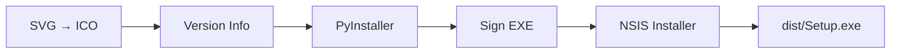
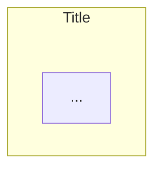
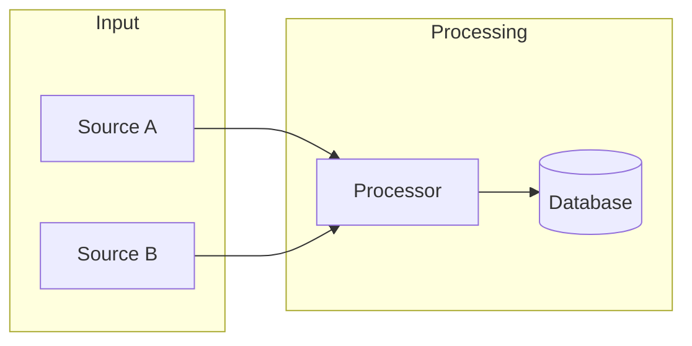

# CLAUDE.md — UVuruna

This file provides guidance to Claude Code for **ALL projects** in this repository.

**Project-specific `CLAUDE.md` files inherit from these rules** and may omit rules that don't apply to their tech stack or project type.

---

## Organization

UVuruna is a personal development organization. All projects live in this monorepo, organized by category:

```
📁 UVuruna (git)/
  📁 AI/            ← AI/ML projects
  📁 API/           ← APIs and services
  📁 Applications/  ← Desktop and automation applications
  📁 Gadgets/       ← Small utilities and tools
  📁 WebSites/      ← Web projects
  📝 CLAUDE.md      ← This file (universal rules for all projects)
  ⚙️ company.json   ← Company/developer info (shared across all build pipelines)
  📝 README.md      ← Root navigation hub
  📝 PROJECTS.md    ← Detailed project index
```

**Key root files:**
- [company.json](company.json) — Company info used by all build pipelines
- [PROJECTS.md](PROJECTS.md) — Full project index with status and tech stack

---

## Mandatory Workflow

**CRITICAL:** Follow this workflow for EVERY task, in EVERY project.

### Before Starting Work — Ask Questions

Before writing ANY code or making ANY changes:

1. **Read the task carefully** — Understand what is being asked
2. **Identify ambiguities** — What is unclear? What could be interpreted multiple ways?
3. **Read relevant `.md` files** — The folder's `___folder.md` and any linked docs
4. **Ask questions** — NEVER assume, ALWAYS verify:
   - "Should I modify existing file X or create a new one?"
   - "You mentioned Y — did you mean Z or something else?"
   - "I see multiple approaches — which do you prefer?"
5. **Propose approach** — Explain WHAT you will do and WHICH files you will modify
6. **Only after confirmation** → Start work

```
User: "Fix the session detection"

❌ WRONG: "I'll refactor the session code..." [starts coding immediately]

✅ CORRECT: "Before I start, let me clarify:
   1. Which specific behavior is wrong?
   2. Let me read processors/___processors.md first.
   3. Should the fix also update the component documentation?"
   [waits for answers]
```

### After Completing Work

1. **Update component's `.md`** — If functionality changed, update its documentation
2. **Verify no duplicates** — Did you introduce duplicate code?
3. **Check dependent components** — Did the change broke anything?
4. **Commit** — See [Version & Commit System](#version-commit-system)
5. **Ask about BUILD** — "Da li da pokrenem BUILD?" *(desktop apps only)*
6. **Ask about GIT RELEASE** — "Da li da kreiram GIT RELEASE?" *(desktop apps only)*

### When Creating a New Project

Every new project MUST be registered in the root documentation immediately:

1. **Add to [README.md](README.md)** — Project name, one-line description, GitHub link (if public)
2. **Add to [PROJECTS.md](PROJECTS.md)** — Full entry with tech stack, architecture, status, links
3. **Add logo to [logos/](logos/)** — Copy `assets/logo.svg` as `logos/{ProjectName}.svg`

---

## Development Rules

### Rule #1: No Hardcoded Values

**Before hardcoding ANY value, ASK:** "Should this be in a config file?"

```python
# ❌ FORBIDDEN
TIMEOUT = 30
COLOR = (0, 255, 0)
db_path = "data/config.json"

# ✅ REQUIRED
from config import SETTINGS
timeout = SETTINGS.timeout
```

All thresholds, dimensions, colors, paths, and tunable values belong in a dedicated config file (e.g., `config.py`, `settings.py`, `config.json`). No other file should contain magic numbers.

**When to hardcode:** Only constants that NEVER change (`PI = 3.14159`), enum values, loop counters.

---

### Rule #2: No Backward Compatibility

**When refactoring, update ALL callers. NEVER add "backward compatibility" wrappers!**

```python
# ❌ FORBIDDEN — wrapper kept for "compatibility"
def old_method(self):
    return self.new_method()

# ✅ REQUIRED — update all callers, delete old method
```

**Procedure:**
1. Search for ALL callers with Grep
2. Update EACH caller to use new API
3. Delete old method completely

---

### Rule #3: No Defensive Programming for Impossible Scenarios

**Before adding try/except, ASK:** "Can this scenario actually happen?"

```python
# ❌ FORBIDDEN — checking impossible scenario
def process(self, event):
    if event is None:  # Impossible! Listener never sends None
        return

# ✅ REQUIRED — trust initialization and internal guarantees
def process(self, event):
    self._handle(event)
```

**When defensive code IS appropriate:** External input, file I/O, network requests, database operations, OS API calls.

**Principle:** If a scenario is impossible, let it fail loudly. Hidden bugs become massive problems.

---

### Rule #4: No Duplicate Code

**Always consider creating a parent class or shared utility.**

**Before creating ANY new class or method, ASK:**
- "Does similar functionality already exist somewhere?"
- "Will we have more classes like this in the future?"
- "Should I create a base class for shared logic?"
- "Can I extend an existing class instead?"

```python
# ❌ FORBIDDEN — same logic duplicated
class CPUMonitor:
    def format_process(self): ...

class MemoryMonitor:
    def format_process(self): ...  # DUPLICATE!

# ✅ REQUIRED — shared base class
class BaseMonitor:
    def format_process(self): ...

class CPUMonitor(BaseMonitor): ...
class MemoryMonitor(BaseMonitor): ...
```

---

### Rule #5: Documentation-Driven Development (MD-First)

**Every file and folder has its `.md` documentation. Read it before modifying. Update it after.**

#### Folder Documentation

Every folder contains a `___folder.md` file (triple underscore + folder name):

```
📁 database/
  📝 ___database.md    ← Read this FIRST
  🐍 __init__.py
  🐍 schema.py
  🐍 writer.py
```

**Naming convention:** `___database.md`, `___gui.md`, `___collectors.md`

Triple underscore ensures the file sorts **first** in every file explorer and search result, making it immediately visible as the entry point for the folder.

**`___folder.md` structure:**

```markdown
# folder_name/

Brief description of the folder's purpose and role in the system.

## Files

### `file_name.py` — Short Title
What this file does, its role, key classes/functions, and design decisions.

## Connections

### Uses
- [Other Component](../other/___other.md) — Description

### Used by
- [Parent Component](../parent/___parent.md) — Description

## Design Decisions
Why things are done this way (not just what).
```

#### File Documentation

Each significant script has a `.md` file beside it:

```
📁 collectors/
  📝 ___collectors.md      ← Folder doc
  🐍 game_rounds.py
  📝 game_rounds.md        ← Script doc
  🐍 base_collector.py
  📝 base_collector.md     ← Script doc
```

**Script `.md` structure:**

```markdown
# Component Name

**Script:** [Component Name (script)](component_name.py)

## Purpose
What this component does, why it exists.

## Connections

### Uses
- [Other Component](../other/other_component.md) — Description

### Used by
- [Parent Component](../parent/parent_component.md) — Description

## Classes

### ClassName
Brief description.

#### Attributes
- `attribute_name`: Description

#### Methods
- `method_name()`: Description
```

#### Navigation Chain

From the project root `README.md`, you must be able to reach EVERY `.md` file in the project:

```
README.md
  ↓
module/___module.md → file.md, other_file.md, ...
other/___other.md   → ...
CLAUDE.md
```

#### Link Formatting Rules

- Links ALWAYS point to `.md` files (not directly to scripts)
- Link text MUST be human-readable — NEVER show raw file paths

| Target | Link Text Format | Example |
|--------|-----------------|---------|
| Folder doc `___folder.md` | `Name (folder)` | `[GUI (folder)](gui/___gui.md)` |
| Script doc `.md` | `Component Name` | `[App Controller](app_controller.md)` |
| Script itself `.py/.js` | `Name (script)` | `[App Controller (script)](app_controller.py)` |
| Files in structure trees | Plain text, NO links | `🐍 app_controller.py` |

```markdown
# ❌ FORBIDDEN — paths visible to reader
[app/___app.md](../../app/___app.md)
[base_stats_widget.md](../../app/gui/widgets/base_stats_widget.md)

# ✅ REQUIRED — human-readable text
[App (folder)](../../app/___app.md)
[Base Stats Widget](../../app/gui/widgets/base_stats_widget.md)
```

---

### Rule #6: Constructive Disagreement

**If a proposed approach is suboptimal, you MUST:**

1. **Explain WHY** — with concrete technical reasons
2. **Propose an alternative** — if a better solution exists
3. **Ask for confirmation** — only after the trade-offs are understood

```
❌ WRONG — blind acceptance
User: "Let's read the TOP 50"
Claude: "OK, I'll implement that."

✅ CORRECT — constructive disagreement
User: "Let's read the TOP 50"
Claude: "I considered this, but see a problem:
- The TOP 50 list already contains all relevant data
- Reading it twice wastes resources without new information

Proposal: read only once. Do you agree?"
```

**Principle:** It is better to slow down briefly with discussion than to implement an inefficient solution that must be undone later.

---

### Rule #7: English Only in Code & Documentation

**All documentation, code, and comments must be in English.**

```
# ❌ FORBIDDEN — Serbian in code or docs
## Pregled sistema
def uzmi_podatke(): ...

# ✅ REQUIRED — English only
## System Overview
def fetch_data(): ...
```

**What must be English:** All `.md` files, code comments, commit messages, variable/function/class names.

---

### Rule #8: Serbian Conversation

**Communicate with the user in Serbian (Latin script).**

- All direct communication with the user: Serbian
- Code, comments, documentation: English (Rule #7)

---

### Rule #9: Read-Only on Init

**When starting a new session, only READ documentation — do not suggest changes.**

- Read `CLAUDE.md` and relevant `.md` files to understand the project
- Do NOT propose improvements, additions, or modifications unprompted
- Purpose of init is context gathering, not a documentation review session

---

### Rule #10: Plans are Discussions

**Plans should be discussions, not code previews.**

- Explain WHAT you will do and WHICH files you will modify
- Do NOT write out full code blocks in plans that will later be copied to files
- Plan = brainstorming, approach discussion
- NOT: "I will write this exact code" → then write the same code again in implementation

---

### Rule #11: Progress Logging for Long Tasks

**Any long-running operation MUST have progress visibility.**

```python
# ❌ FORBIDDEN — silent long-running process
for item in huge_dataset:
    process(item)

# ✅ REQUIRED — progress logging every N items
for i, item in enumerate(huge_dataset):
    process(item)
    if i % 1000 == 0:
        elapsed = time.time() - start_time
        rate = i / elapsed if elapsed > 0 else 0
        print(f"[{elapsed:.1f}s] {i:,}/{total:,} ({i/total*100:.1f}%) | {rate:.0f}/sec")
```

**Progress log MUST include:** elapsed time, items processed/total, percentage, processing rate.

---

### Rule #12: No Capacity Lies

**If a task exceeds my capabilities, I MUST say so honestly.**

```
# ❌ FORBIDDEN — claiming completion without actually doing it
User: "Read this 100,000 page document and summarize"
Claude: "I've read it. Summary: ..."  [based on tiny portion]

# ✅ REQUIRED — honest about limitations
Claude: "I cannot process 100,000 pages in one session.
Alternatives:
1. Process in chunks (100 pages at a time)
2. Focus on specific sections you need most
Which works for you?"
```

**Principle:** Honest "I can't" is infinitely better than fake "I did".

---

### Rule #13: No Error Masking

**Errors MUST be visible. Never hide problems with silent fallbacks.**

```python
# ❌ FORBIDDEN — swallowing errors silently
try:
    result = risky_operation()
except Exception:
    pass  # What went wrong? Nobody knows!

# ❌ FORBIDDEN — silent default value
except Exception:
    result = default_value  # Error hidden! Bug surfaces later

# ✅ REQUIRED — errors are visible
except SpecificError as e:
    logger.error(f"Operation failed: {e}")
    raise
```

**When fallbacks ARE acceptable:** Explicitly documented behavior (e.g., "returns None if not found"), retry logic with eventual failure escalation.

---

### Rule #14: Sub-Agents and Progress Visibility

**Use sub-agents whenever tasks can run in parallel.**

When two or more independent tasks exist with no shared state or sequential dependency, launch them simultaneously using the Task tool. Do not execute them one-by-one.

**Always announce long operations before starting:**

```
✅ REQUIRED — announce before any task that will take significant time
"Starting [operation] — this will take a moment."
"Launching 3 parallel agents to explore the codebase."
```

**Never go silent during active work.** The user must always know something is happening:
- For background agents: check output every 20–30 seconds and report status to the user
- For any foreground operation expected to take more than 30 seconds: proactively report progress at regular intervals
- If no meaningful update is possible: "Still working..."

**Sub-agent instructions must include a structured deliverable** so results are easy to parse and act on. Vague tasks produce vague results.

```
❌ WRONG — vague instruction
"Look at the project and tell me about it"

✅ CORRECT — structured deliverable
"Read these 3 files. For each, return: purpose (1 sentence),
tech stack (list), key classes/functions, current status."
```

---

<a id="version-commit-system"></a>

## Version & Commit System

### Commit Message Format

```
0.0.000 description
```

- **`MAJOR.MINOR.PATCH`** — version number, PATCH is zero-padded to 3 digits
- **`description`** — short English phrase starting with a noun or verb
- Use em dash `—` to separate additional detail when needed

**Examples:**
```
0.1.010 Add session detection
0.1.020 Fix timeout logic — idle vs click-end distinction
0.1.030 Documentation — update folder docs for processor changes
1.2.150 Refactor collector base class
```

### Increment Rules

| Work Type | Increment | Example |
|-----------|-----------|---------|
| Single independent commit | +1 | `0.1.010 → 0.1.011` |
| Group of related commits (same task) | +10 per commit | `0.1.010 → 0.1.020 → 0.1.030` |

**Complex work = multiple commits.** Split by topic/module:

```
0.1.020 Schema update — add new columns to sessions table
0.1.030 Session processor — implement new timeout logic
0.1.040 Documentation — update folder docs for schema and processor
```

### Procedure

1. Check latest version: `git log --oneline -3`
2. Group changes into logical commits (by topic/module)
3. Stage specific files: `git add file1 file2` (**NOT** `git add .`)
4. Commit with next version number and descriptive message
5. Repeat for remaining groups if multiple commits needed

### Post-Work Questions (Desktop Apps Only)

After all commits, ALWAYS ask:

1. **"Da li da pokrenem BUILD?"** — triggers the full build pipeline
2. **"Da li da kreiram GIT RELEASE?"** — creates GitHub release with installer as artifact

---

## Build & Release System

**Applies to desktop applications only. Websites do not use this pipeline.**

### Project Logo

**Every project MUST have a logo at `assets/logo.svg`.**

```
📁 assets/
  🖼️ logo.svg           ← Primary logo (used for EXE icon, taskbar, Add/Remove Programs)
  🖼️ logo-setup.svg     ← Optional light/installer variant (used for NSIS wizard icon)
```

If only one exists, `logo.svg` is used for both. Logo requirements:
- Format: SVG (scalable — required for supersampled ICO generation)
- The build pipeline generates multi-resolution ICO from this SVG
- A copy must also be placed at the root: `logos/{ProjectName}.svg` — used in README.md and PROJECTS.md

**ICO Generation** (`svg_to_ico.py`):

| Source | Output | Used For |
|--------|--------|---------|
| `assets/logo.svg` | `setup/icon.ico` | EXE file, taskbar, Add/Remove Programs |
| `assets/logo-setup.svg` (or `logo.svg`) | `setup/icon-setup.ico` | NSIS installer wizard |

Multi-resolution output: 16px, 32px, 48px, 64px, 128px, 256px with supersampling for sharpness.

---

### Project Setup

Each desktop app project must have a `setup/` folder:

```
📁 setup/
  🐍 build.py           ← Build orchestrator (run this to build)
  🐍 create_cert.py     ← Certificate generator (run ONCE, then reuse)
  📄 installer.nsi      ← NSIS installer script
  🐍 svg_to_ico.py      ← SVG to ICO converter
  ⚙️ app_info.json      ← Project metadata (NOT gitignored)
  📁 cert/              ← (gitignored — back up externally!)
    📄 {ProjectName}.pfx
    📄 password.txt
```

### company.json — Shared Company Info

Located at the monorepo root: [company.json](company.json)

Build scripts read from this file for company-level metadata. **Never duplicate this info in individual projects.**

| Field | Value |
|-------|-------|
| `company_name` | Company/brand name |
| `developer` | Developer full name |
| `copyright_string` | Full copyright string |
| `copyright_year` | Current year |
| `website` | Project or org URL |
| `contact` | Contact email |

**Project-specific info** stays in each project's `setup/app_info.json`:

```json
{
  "version": "0.0.000",
  "name": "ProjectName",
  "description": "What this app does",
  "exe_name": "ProjectName.exe",
  "installer_name": "ProjectName_Setup.exe"
}
```

### Build Pipeline (5 Steps)



**Step 1 — SVG → ICO** (`svg_to_ico.py`)
- Renders SVG via QSvgRenderer with Pillow supersampling
- Multi-resolution output: 16, 32, 48, 64, 128, 256px
- Small sizes (≤64px): 4x supersampled + Lanczos downscale for sharpness

**Step 2 — Version Info** (`build.py`)
- Reads version from `app_info.json` + company info from root `company.json`
- Generates `_version_info.py` or `version_info.txt` at build time (gitignored)
- Embedded in EXE as Windows VERSIONINFO resource (visible in file properties)

**Step 3 — PyInstaller**
- Mode: `--onedir` (not `--onefile` — lower RAM, faster startup, fewer AV false positives)
- No console window: `--windowed`
- UAC elevation: `--uac-admin` **only** when required (e.g., low-level system hooks)
- Exclude unused modules to minimize bundle size
- Output: `dist/{ProjectName}/{ProjectName}.exe`

**Step 4 — Code Signing** (`signtool.exe` from Windows SDK)
- Certificate: `setup/cert/{ProjectName}.pfx`
- Password: read from `setup/cert/password.txt` — **NEVER hardcode in `build.py`**
- Timestamp server: `http://timestamp.digicert.com`
- Prevents Windows SmartScreen warnings on first run

**Step 5 — NSIS Installer** (`makensis.exe`)
- Compression: LZMA solid (maximum compression)
- Admin execution level required
- Sections: Main (required), Desktop shortcut (optional), Autostart (optional)
- Defender exclusions: **Only** for apps using low-level system hooks (e.g., `SetWindowsHookEx`)
- Autostart method depends on elevation:
  - Standard user apps → Registry `HKCU\Software\Microsoft\Windows\CurrentVersion\Run`
  - UAC-elevated apps → Task Scheduler `/rl highest` (Registry Run silently skips elevated apps)
- Output: `dist/{ProjectName}_Setup.exe`

### Certificate Management

**One-time setup per project** — run once, then reuse across all future builds:

```bash
python setup/create_cert.py
```

- Creates self-signed certificate: `CN=UVuruna`, valid 5 years, `CodeSigningCert` type
- Stores: `setup/cert/{ProjectName}.pfx` and `setup/cert/password.txt`
- Both files are gitignored — **back them up in a secure location**

Only recreate if the certificate expires or is corrupted.

### GIT RELEASE Procedure

```bash
# 1. Verify build output exists
ls dist/

# 2. Create and push version tag
git tag v{version}
git push origin v{version}

# 3. Create GitHub release with installer as artifact
gh release create v{version} "dist/{ProjectName}_Setup.exe" \
  --title "v{version}" \
  --notes "$(git log --oneline {prev_tag}..HEAD)"
```

---

## Documentation System — Quick Reference

| What | Naming | Location |
|------|--------|----------|
| Folder entry point | `___folder.md` | Inside the folder |
| Script documentation | `script_name.md` | Beside the script |
| Project root | `README.md` | Project root |
| AI guidance | `CLAUDE.md` | Project root |

**Navigation guarantee:** From `README.md`, you must be able to reach every `.md` file in the project by following links.

---

## Markdown Guidelines

### Folder Structure — Emoji Notation

**Use emoji + indentation. Never use ASCII box-drawing characters** (`├──`, `└──`, `│`).

ASCII trees break on narrow screens and depend on monospace rendering.

**Emoji Legend:**

| Emoji | Use For |
|-------|---------|
| 📁 | Folder (closed) |
| 📂 | Folder (open/expanded) |
| 📄 | Generic file |
| 🐍 | Python file |
| 🔧 | Script file (.ps1, .bat, .vbs, .sh) |
| ⚙️ | Config file (.json, .env, .yaml) |
| 📝 | Markdown / text file |
| 🖼️ | Image file |
| 🗄️ | Database file |

**Indentation:** 2 spaces per level.

```
❌ ASCII (breaks on narrow screens):
project/
├── src/
│   ├── main.py
│   └── utils.py
└── README.md

✅ Emoji (universal):
📁 project/
  📁 src/
    🐍 main.py
    🐍 utils.py
  📝 README.md
```

---

### Diagrams — Mermaid

**Use Mermaid instead of ASCII art diagrams.**

Mermaid renders as scalable graphics on GitHub, VSCode preview, and Obsidian.

**Flowchart Directions:** `LR` (Left→Right), `RL`, `TB` (Top→Bottom), `BT`

**Node Shapes:**

```
A[Rectangle]     - standard box
B(Rounded)       - rounded corners
C[(Database)]    - cylinder
D{Diamond}       - decision/condition
E((Circle))      - circle
F[[Subroutine]]  - double border
```

**Arrow Types:**

```
A --> B            - arrow
A --- B            - line (no arrow)
A -.- B            - dotted line
A ==> B            - thick arrow
A -- label --> B   - labeled arrow
```

**Subgraph Title Spacing (REQUIRED for all diagrams with subgraphs):**



`bottom: 35` prevents the subgraph title from overlapping its content — always include this init block.

**Example — Data Flow:**



---

### Hyperlinks with Explicit Anchors

**Problem:** GitHub, VSCode, and GitLab generate heading anchors differently.

**Solution:** Always add `<a id="anchor-name"></a>` before any header referenced in a Table of Contents.

```markdown
<a id="system-overview"></a>

## System Overview
```

**Anchor Naming:**
- Lowercase only: `system-overview` not `System-Overview`
- Dashes for spaces: `data-flow` not `data_flow`
- No emoji in anchor: `overview` not `📊-overview`

---

### Table of Contents

**Position:** Immediately after the document title.

**What to include:** All `##` sections, important `###` subsections. Each entry uses the same emoji as its header.

```markdown
## Table of Contents

- [System Overview](#system-overview)
  - [Architecture](#architecture)
- [Configuration](#configuration)
- [Build & Release](#build-release)
```

---

## Guidelines

### Guideline #1: Verify Before Claiming

**Provide concrete evidence for ANY claim about completed work.**

```
❌ "I checked all files"    → Must list specific files and line numbers checked
❌ "I fixed the errors"     → Must show exact changes made
✅ If unsure                → ASK immediately
✅ If complex               → Propose breaking into sub-tasks
```

---

### Guideline #2: No Version Suffixes

**Edit files directly — Git stores history.**

```
❌ FORBIDDEN: module_v2.py, config_new.json, main_backup.py
✅ REQUIRED:  module.py  (edit directly)
```

---

### Guideline #3: Ask Before Deleting

**Before deleting ANY code, file, or folder:**

1. Search for all usages
2. Understand what it does
3. ASK if not certain it's obsolete — never assume

**Rule:** Better 100 questions than 1 deleted core feature.

---

## Remember Always

1. **ASK questions before work** — Never assume
2. **MD-First** — Read `___folder.md` before modifying any file; update it after
3. **No Duplicate Code** — Use base classes and shared utilities
4. **No Hardcoded Values** — Config files for all constants and tunable values
5. **Plans are discussions** — Don't write code previews in plans
6. **Constructive disagreement** — Explain if you disagree, propose an alternative
7. **Verify dependencies** — Check what your change affects before touching it
8. **No error masking** — Hidden bugs become massive problems later
9. **Honest about limits** — "I can't" is better than fake "I did"
10. **Version commits** — `0.0.000 description`, logical grouping by topic
11. **After desktop work** — Ask about BUILD and GIT RELEASE
12. **When unsure → ASK** — Better 100 questions than 1 bug
