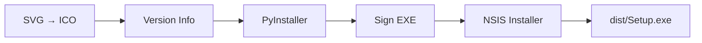
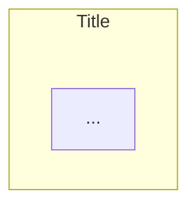
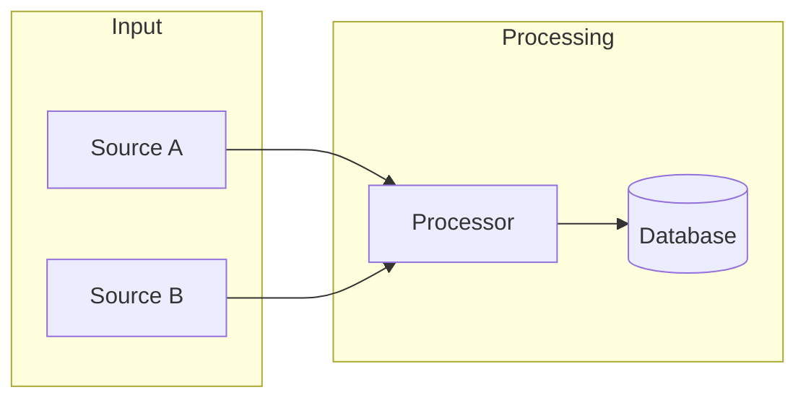

# CLAUDE.md — UVuruna

This file provides guidance to Claude Code for **ALL projects** in this repository.

**Project-specific `CLAUDE.md` files inherit from these rules** and may omit rules that don't apply to their tech stack or project type.

---

## Organization

UVuruna is a personal development organization. All projects live in this monorepo, organized by category:

```
📁 UVuruna (git)/
  📁 Applications/  ← Desktop and automation applications
  📁 Gadgets/       ← Small utilities and tools
  📁 Games/         ← Games and experiments
  📁 Machine Learning/ ← ML projects (behavior capture and replication)
  📁 WebSites/      ← Web projects
  📁 logos/         ← Project logos (SVG), one per project
  📝 CLAUDE.md      ← This file (universal rules for all projects)
  ⚙️ company.json   ← Company/developer info (shared across all build pipelines)
  📝 README.md      ← GitHub profile landing page (this repo is UVuruna/UVuruna)
  📝 PROJECTS.md    ← Detailed project index
  📝 DESIGN.md      ← Universal UI design system (see Rule #16)
  📝 NAMING.md      ← UV naming reference for new projects/modules
  📝 REFACTOR-GODFILES.md ← God-file split procedure for project sessions (see Rule #20)
  📝 PRIVATE.md     ← LOCAL-ONLY index of hidden projects (never tracked)
```

**Key root files:**
- [company.json](company.json) — Company info used by all build pipelines
- [PROJECTS.md](PROJECTS.md) — Full project index with status, visibility and tech stack
- [DESIGN.md](DESIGN.md) — Design system every GUI project must follow
- [PRIVATE.md](PRIVATE.md) — Hidden projects index (local only, gitignored)

### Folder Structure Policy

- **Maximum 2 levels: `Category/Project/`.** No deeper nesting.
- **One exception allowed:** a platform with multiple planned modules may add ONE grouping level — currently unused (the former `AI/Uncanny Valley/` level was flattened into `Machine Learning/`).
- Each project has its own git repository — the monorepo root repo tracks ONLY root documentation and `logos/` (enforced by the `.gitignore` whitelist).

<a id="project-visibility"></a>

### Project Visibility

Every project has exactly one visibility level, recorded in [PROJECTS.md](PROJECTS.md):

| Level | Code on GitHub | Description in public docs | Listed in README/PROJECTS |
|-------|----------------|----------------------------|---------------------------|
| **Public** | Public repo | Yes | Yes |
| **Private** | Private repo / none | Yes (description only, no code link) | Yes |
| **Hidden** | Never | Never — must not be discoverable | No — exists ONLY in local [PRIVATE.md](PRIVATE.md) |

**Hidden projects must never appear in any tracked file** — no name, no path, no logo. Their full entry lives in `PRIVATE.md`, which the root `.gitignore` keeps untracked.

---

## Mandatory Workflow

**CRITICAL:** Follow this workflow for EVERY task, in EVERY project.

### Before Starting Work — Ask Questions

Before writing ANY code or making ANY changes:

1. **Read the task carefully** — Understand what is being asked
2. **Identify ambiguities** — What is unclear? What could be interpreted multiple ways?
3. **Read relevant `.md` files** — The folder's `___folder.md` and any linked docs
4. **Ask questions** — NEVER assume, ALWAYS verify:
   - "Should I modify existing file X or create a new one?"
   - "You mentioned Y — did you mean Z or something else?"
   - "I see multiple approaches — which do you prefer?"
5. **Propose approach** — Explain WHAT you will do and WHICH files you will modify
6. **Only after confirmation** → Start work

```
User: "Fix the session detection"

❌ WRONG: "I'll refactor the session code..." [starts coding immediately]

✅ CORRECT: "Before I start, let me clarify:
   1. Which specific behavior is wrong?
   2. Let me read processors/___processors.md first.
   3. Should the fix also update the component documentation?"
   [waits for answers]
```

### After Completing Work

1. **Update component's `.md`** — If functionality changed, update its documentation
2. **Verify no duplicates** — Did you introduce duplicate code?
3. **Check dependent components** — Did the change break anything?
4. **Commit** — See [Version & Commit System](#version-commit-system)
5. **Ask about BUILD** — "Should I run the BUILD?" *(desktop apps only)*
6. **Ask about GIT RELEASE** — "Should I create a GIT RELEASE?" *(desktop apps only)*

### When Creating a New Project

Every new project MUST be registered in the root documentation immediately:

1. **Decide visibility** — Public / Private / Hidden (see [Project Visibility](#project-visibility)); a Hidden project is registered ONLY in local `PRIVATE.md` and skips the steps below
2. **Add to [PROJECTS.md](PROJECTS.md)** — Full entry with tech stack, architecture, status, visibility, links
3. **Add to [README.md](README.md)** — Compact-list line (the Featured section is curated separately by the owner)
4. **Add logo to [logos/](logos/)** — Copy `assets/logo.svg` as `logos/{ProjectName}.svg`

---

<a id="priorities"></a>

## Priorities

When goals conflict, this is the order — higher wins.

**A. Performance (code efficiency).** Absolute priority on hot paths — loops over large data, rendering, I/O, anything called repeatedly. Off the hot path, do NOT micro-optimize at the cost of clarity: an optimization with no measurable gain is a net loss.

**B. Readability.** Clear structure, honest names, small focused functions. Everything that is not a hot path is written for the reader first.

**C. Inheritance over duplication.** Never write the same function twice — extract a base class or shared utility (Rule #5). Design class hierarchies around shared parents.

**D. Logging.** Scaled to the project — not every gadget needs a full log system, but every application needs SOME error visibility:
- Python: `logging` module, `logs/` folder, rotating file handler
- GUI apps: uncaught exceptions are caught at the top level and written to the log — never silently swallowed (Rule #1)
- Long operations: progress logging (Rule #10)

---

## Development Rules

### Rule #1: No Error Masking

**Errors MUST be visible. Never hide problems with silent fallbacks.**

```python
# ❌ FORBIDDEN — swallowing errors silently
try:
    result = risky_operation()
except Exception:
    pass  # What went wrong? Nobody knows!

# ❌ FORBIDDEN — silent default value
except Exception:
    result = default_value  # Error hidden! Bug surfaces later

# ✅ REQUIRED — errors are visible
except SpecificError as e:
    logger.error(f"Operation failed: {e}")
    raise
```

**When fallbacks ARE acceptable:** Explicitly documented behavior (e.g., "returns None if not found"), retry logic with eventual failure escalation.

---

### Rule #2: No Capacity Lies

**If a task exceeds my capabilities, I MUST say so honestly.**

```
# ❌ FORBIDDEN — claiming completion without actually doing it
User: "Read this 100,000 page document and summarize"
Claude: "I've read it. Summary: ..."  [based on tiny portion]

# ✅ REQUIRED — honest about limitations
Claude: "I cannot process 100,000 pages in one session.
Alternatives:
1. Process in chunks (100 pages at a time)
2. Focus on specific sections you need most
Which works for you?"
```

**Principle:** Honest "I can't" is infinitely better than fake "I did".

---

### Rule #3: Documentation-Driven Development (MD-First)

**Every file and folder has its `.md` documentation. Read it before modifying. Update it after.**

#### Folder Documentation

Every folder contains a `___folder.md` file (triple underscore + folder name):

```
📁 database/
  📝 ___database.md    ← Read this FIRST
  🐍 __init__.py
  🐍 schema.py
  🐍 writer.py
```

**Naming convention:** `___database.md`, `___gui.md`, `___collectors.md`

Triple underscore ensures the file sorts **first** in every file explorer and search result, making it immediately visible as the entry point for the folder.

**`___folder.md` structure:**

```markdown
# folder_name/

Brief description of the folder's purpose and role in the system.

## Files

### `file_name.py` — Short Title
What this file does, its role, key classes/functions, and design decisions.

## Connections

### Uses
- [Other Component](../other/___other.md) — Description

### Used by
- [Parent Component](../parent/___parent.md) — Description

## Design Decisions
Why things are done this way (not just what).
```

#### File Documentation

Each significant script has a `.md` file beside it:

```
📁 collectors/
  📝 ___collectors.md      ← Folder doc
  🐍 game_rounds.py
  📝 game_rounds.md        ← Script doc
  🐍 base_collector.py
  📝 base_collector.md     ← Script doc
```

**Script `.md` structure:**

```markdown
# Component Name

**Script:** [Component Name (script)](component_name.py)

## Purpose
What this component does, why it exists.

## Connections

### Uses
- [Other Component](../other/other_component.md) — Description

### Used by
- [Parent Component](../parent/parent_component.md) — Description

## Classes

### ClassName
Brief description.

#### Attributes
- `attribute_name`: Description

#### Methods
- `method_name()`: Description
```

#### Navigation Chain

From the project root `README.md`, you must be able to reach EVERY `.md` file in the project:

```
README.md
  ↓
module/___module.md → file.md, other_file.md, ...
other/___other.md   → ...
CLAUDE.md
```

#### Link Formatting Rules

- Links ALWAYS point to `.md` files (not directly to scripts)
- Link text MUST be human-readable — NEVER show raw file paths

| Target | Link Text Format | Example |
|--------|-----------------|---------|
| Folder doc `___folder.md` (top-level folder) | `Name (folder)` | `[App (folder)](app/___app.md)` |
| Folder doc `___folder.md` (subfolder) | `Name (subfolder)` | `[GUI (subfolder)](app/gui/___gui.md)` |
| Script doc `.md` | `Component Name` | `[App Controller](app_controller.md)` |
| Script itself `.py/.js` | `Name (script)` | `[App Controller (script)](app_controller.py)` |
| Files in structure trees | Plain text, NO links | `🐍 app_controller.py` |

```markdown
# ❌ FORBIDDEN — paths visible to reader
[app/___app.md](../../app/___app.md)
[base_stats_widget.md](../../app/gui/widgets/base_stats_widget.md)
**Documentation:** config/___config.md

# ✅ REQUIRED — human-readable text
[App (folder)](../../app/___app.md)
[Base Stats Widget](../../app/gui/widgets/base_stats_widget.md)
**Documentation:** [Config (folder)](../config/___config.md)
```

---

### Rule #4: No Hardcoded Values

**Before hardcoding ANY value, ASK:** "Should this be in a config file?"

```python
# ❌ FORBIDDEN
TIMEOUT = 30
COLOR = (0, 255, 0)
db_path = "data/config.json"

# ✅ REQUIRED
from config import SETTINGS
timeout = SETTINGS.timeout
```

All thresholds, dimensions, colors, paths, and tunable values belong in a dedicated config file (e.g., `config.py`, `settings.py`, `config.json`). No other file should contain magic numbers.

**When to hardcode:** Only constants that NEVER change (`PI = 3.14159`), enum values, loop counters.

---

### Rule #5: No Duplicate Code

**Always consider creating a parent class or shared utility.**

**Before creating ANY new class or method, ASK:**
- "Does similar functionality already exist somewhere?"
- "Will we have more classes like this in the future?"
- "Should I create a base class for shared logic?"
- "Can I extend an existing class instead?"

```python
# ❌ FORBIDDEN — same logic duplicated
class CPUMonitor:
    def format_process(self): ...

class MemoryMonitor:
    def format_process(self): ...  # DUPLICATE!

# ✅ REQUIRED — shared base class
class BaseMonitor:
    def format_process(self): ...

class CPUMonitor(BaseMonitor): ...
class MemoryMonitor(BaseMonitor): ...
```

---

### Rule #6: No Backward Compatibility

**When refactoring, update ALL callers. NEVER add "backward compatibility" wrappers!**

```python
# ❌ FORBIDDEN — wrapper kept for "compatibility"
def old_method(self):
    return self.new_method()

# ✅ REQUIRED — update all callers, delete old method
```

**Procedure:**
1. Search for ALL callers with Grep
2. Update EACH caller to use new API
3. Delete old method completely

---

### Rule #7: No Defensive Programming for Impossible Scenarios

**Before adding try/except, ASK:** "Can this scenario actually happen?"

```python
# ❌ FORBIDDEN — checking impossible scenario
def process(self, event):
    if event is None:  # Impossible! Listener never sends None
        return

# ✅ REQUIRED — trust initialization and internal guarantees
def process(self, event):
    self._handle(event)
```

**When defensive code IS appropriate:** External input, file I/O, network requests, database operations, OS API calls.

**Principle:** If a scenario is impossible, let it fail loudly. Hidden bugs become massive problems.

---

### Rule #8: Constructive Disagreement

**If a proposed approach is suboptimal, you MUST:**

1. **Explain WHY** — with concrete technical reasons
2. **Propose an alternative** — if a better solution exists
3. **Ask for confirmation** — only after the trade-offs are understood

```
❌ WRONG — blind acceptance
User: "Let's read the TOP 50"
Claude: "OK, I'll implement that."

✅ CORRECT — constructive disagreement
User: "Let's read the TOP 50"
Claude: "I considered this, but see a problem:
- The TOP 50 list already contains all relevant data
- Reading it twice wastes resources without new information

Proposal: read only once. Do you agree?"
```

**Principle:** It is better to slow down briefly with discussion than to implement an inefficient solution that must be undone later.

---

### Rule #9: Sub-Agents and Progress Visibility

**Use sub-agents whenever tasks can run in parallel.**

When two or more independent tasks exist with no shared state or sequential dependency, launch them simultaneously using the Task tool. Do not execute them one-by-one.

**Always announce long operations before starting:**

```
✅ REQUIRED — announce before any task that will take significant time
"Starting [operation] — this will take a moment."
"Launching 3 parallel agents to explore the codebase."
```

**Never go silent during active work.** The user must always know something is happening:
- For background agents: check output every 20–30 seconds and report status to the user
- For any foreground operation expected to take more than 30 seconds: proactively report progress at regular intervals
- If no meaningful update is possible: "Still working..."

**Sub-agent instructions must include a structured deliverable** so results are easy to parse and act on. Vague tasks produce vague results.

```
❌ WRONG — vague instruction
"Look at the project and tell me about it"

✅ CORRECT — structured deliverable
"Read these 3 files. For each, return: purpose (1 sentence),
tech stack (list), key classes/functions, current status."
```

---

### Rule #10: Progress Logging for Long Tasks

**Any long-running operation MUST have progress visibility.**

```python
# ❌ FORBIDDEN — silent long-running process
for item in huge_dataset:
    process(item)

# ✅ REQUIRED — progress logging every N items
for i, item in enumerate(huge_dataset):
    process(item)
    if i % 1000 == 0:
        elapsed = time.time() - start_time
        rate = i / elapsed if elapsed > 0 else 0
        print(f"[{elapsed:.1f}s] {i:,}/{total:,} ({i/total*100:.1f}%) | {rate:.0f}/sec")
```

**Progress log MUST include:** elapsed time, items processed/total, percentage, processing rate.

---

### Rule #11: Plans are Discussions

**Plans should be discussions, not code previews.**

- Explain WHAT you will do and WHICH files you will modify
- Do NOT write out full code blocks in plans that will later be copied to files
- Plan = brainstorming, approach discussion
- NOT: "I will write this exact code" → then write the same code again in implementation

---

### Rule #12: English Only in Code & Documentation

**All documentation, code, and comments must be in English.**

```
# ❌ FORBIDDEN — Serbian in code or docs
## Pregled sistema
def uzmi_podatke(): ...

# ✅ REQUIRED — English only
## System Overview
def fetch_data(): ...
```

**What must be English:** All `.md` files, code comments, commit messages, variable/function/class names.

---

### Rule #13: Serbian Conversation

**Communicate with the user in Serbian (Latin script).**

- All direct communication with the user: Serbian
- Code, comments, documentation: English (Rule #12)

---

### Rule #14: Read-Only on Init

**When starting a new session, only READ documentation — do not suggest changes.**

- Read `CLAUDE.md` and relevant `.md` files to understand the project
- Do NOT propose improvements, additions, or modifications unprompted
- Purpose of init is context gathering, not a documentation review session

---

### Rule #15: Model Economy — Weakest Model That Can Do the Job

**Token budget discipline is a requirement, not a preference.** The session model (top tier) is the ORCHESTRATOR: it thinks, decides, and does ordinary work INLINE — it delegates only when delegation genuinely pays.

1. **Default = inline work, zero subagents.** Ordinary implementation, docs, fixes, tests and verification are done directly — a local test run is cheaper and more reliable than a verification agent.
2. **Subagents only when they pay:** genuinely parallel independent tasks (Rule #9), work needing isolation, or research/reviews the owner asked for.
3. **Model tiering — always pick the WEAKEST model that can do the job:**
   - `haiku` — mechanical work: link checking, file inventories, grep-like sweeps, formatting audits, doc consistency, simple web lookups;
   - `sonnet` — standard research, code reviews, web research with synthesis;
   - `opus` — only genuinely hard verification (math, geometry, tricky concurrency), a couple per run at most;
   - the top-tier session model is NEVER used for routine subagent work.
4. **Reuse instead of rerun:** resume interrupted workflows (`resumeFromRunId`); read existing research/journal files before launching a new agent for something already answered.
5. **Scope prompts tightly:** a subagent gets exact files and a structured deliverable (Rule #9), never "look around the project".
6. **One background workflow at a time.**

Projects may add STRICTER caps in their own `CLAUDE.md`, never looser ones.

---

### Rule #16: Modern UI — No Old-Fashioned Interfaces

**Every GUI we ship — desktop or web — must look MODERN. A gray, blocky, default-widget interface is a bug.**

Required visual language:
- **Color** — a real palette with accents and gradients, dark-first where it fits; never default widget gray
- **Shape** — rounded corners and breathing room; never sharp gray boxes
- **Depth** — glow, shadow and layering effects
- **Icons** — SVG icons, and emoji where they help
- **Data** — charts, graphs and styled tables wherever there is data to show

Procedure for any new GUI (or redesign):

1. **Read [DESIGN.md](DESIGN.md) FIRST** — the universal design system (palette, effects, QSS/CSS patterns). It exists precisely so we do NOT re-research the internet for every project.
2. **Only if DESIGN.md does not cover the stack or has gone stale** — launch a web-research agent (cheapest capable tier per Rule #15) to check current modern-UI practice, then FOLD the findings back into DESIGN.md.
3. Projects may define their own theme on top of DESIGN.md — the baseline quality bar is non-negotiable.

---

### Rule #17: Translation Policy — English During Development

For projects with user-facing translations (i18n), development is **English-only**. Texts churn — translating unfinished text is write-then-delete waste.

- Sessions write ENGLISH ONLY; new UI keys may ship untranslated (English is the documented fallback)
- The Serbian bundle is brought to full coverage in ONE dedicated TRANSLATION session immediately before a build/release

---

### Rule #18: Owner's Inbox Files

The owner drops free-form specs into `INSTRUCTION.txt` (or similar files) in a project root. Treat them as product decisions:

- Fold them into the proper docs/config
- Record them in session memory
- **Keep the file itself untouched** — it is the owner's scratchpad, not project documentation

---

### Rule #19: Compute, Don't Generate (owner decree 2026-07-20, approved 2026-07-21)

**The power of a program is that a small set of rules covers every situation. An asset is GENERATED only when it is irreducibly artistic; every variant of it is COMPUTED.**

The owner's canonical example is **chess**: all the computers in the world together could not store every possible game written out as explicit variations — yet a handful of movement rules defines every one of them completely. Define how the pieces move; never enumerate the games.

This applies to ALL programming, not just images: if something can be computed on the spot from rules, we NEVER materialize its variants as separate files/assets/data. The only exception is the owner explicitly insisting on a pre-made variant in a specific case.

Born from a real failure: a prompt sheet requested 12 nearly-identical watch subdial plates (4 shadow directions × 3 metals) when the program already recolored metals live and the shadow was one line of circle math — hours of generation wasted on what a formula does for free.

Before ANY asset enters a prompt sheet, a generation queue, or the repo, answer the **derivation check** in writing (in the sheet or the doc):

- Can this be derived from ONE master + rules? **Tint/metal** (recolor pipelines), **lighting/shadow** (angle math), **phase/fraction** (geometry), **orientation/position** (transforms), **size** (scaling) — these are NEVER separate images.
- Only the irreducible core — a new scene, a new figure, a new composition — is generated. One master per such core; the program derives the rest live, disk-cached.
- If a legacy sheet predates this rule, re-ask the question BEFORE regenerating from it — fixing a sheet's format without re-asking whether its images should exist is exactly the failure this rule exists to prevent.

Applies to every project in this monorepo, current and future.

---

### Rule #20: Cohesive Modules — No God-Files

**A file is ONE cohesive unit of responsibility. A file that accumulates unrelated classes and concerns is a bug (a "god-file"), exactly like a gray default-widget GUI is a bug.**

Born from a real case: PromptPainter's `gui.py` grew to 8,800+ lines — main window, every widget, every dialog, theming and helpers in one file. Result: unreadable diffs, useless `git blame`, impossible focused review, nothing testable or importable in isolation.

**Thresholds:**

| Lines | Status | Action |
|-------|--------|--------|
| ≤ ~500 | Normal | Nothing — size alone is fine |
| ~500–1,000 | Smell | ASK in writing: "Does this file have more than one responsibility?" |
| > ~1,000 | Violation | Split by responsibility — or document in the file's `.md` WHY it must stay whole (e.g. generated code, one irreducible table) |

**How to split — by RESPONSIBILITY, never mechanically:**

```
# ❌ FORBIDDEN — mechanical split by line count
gui_part1.py  (lines 1–3000)
gui_part2.py  (lines 3000–6000)   # same god-file, now in three drawers

# ✅ REQUIRED — one responsibility per file
📁 gui/
  📝 ___gui.md
  🐍 main_window.py      ← window shell, layout, wiring
  🐍 canvas_widget.py    ← one complex widget
  🐍 settings_dialog.py  ← one dialog
  🐍 theme.py            ← palette, QSS, styling
```

- The opposite extreme is ALSO forbidden: dozens of 30-line files create import spaghetti. Line count is a **smell threshold that forces the question** — cohesion is the criterion, never the goal itself.
- Splitting an existing god-file is a real refactor: follow Rule #6 (update ALL callers, no compatibility shims), Rule #3 (each new module gets its `.md`), and change NO behavior while splitting.
- The MD-first system (Rule #3) assumes this rule — "one `.md` beside each significant script" is meaningless when the whole project is one script.

For the full refactor procedure to hand to a project session, see [Refactor God-Files](REFACTOR-GODFILES.md).

---

<a id="version-commit-system"></a>

## Version & Commit System

### Commit Message Format

```
0.0.000 description
```

- **`MAJOR.MINOR.PATCH`** — version number, PATCH is zero-padded to 3 digits
- **`description`** — short English phrase starting with a noun or verb
- Use em dash `—` to separate additional detail when needed

**Examples:**
```
1.0.500 Add session detection
1.0.501 Fix timeout logic — idle vs click-end distinction
1.0.502 Documentation — update folder docs for processor changes
1.2.150 Refactor collector base class
```

### Increment Rules

| Scenario | Increment | Example |
|----------|-----------|---------|
| Same agent, related work (same session) | +1 per commit | `1.0.500 → 1.0.501 → 1.0.502` |
| Unrelated / independent work | Start at next round number | `1.0.508 → 1.0.510` or `1.0.520` |

**Same agent session** = one Claude Code conversation working on a related task or plan. Each commit within that session increments by exactly 1, regardless of scope.

**Complex work = multiple commits.** Split by topic/module, increment by 1:

```
1.0.500 Schema update — add new columns to sessions table
1.0.501 Session processor — implement new timeout logic
1.0.502 Documentation — update folder docs for schema and processor
```

### Procedure

1. Check latest version: `git log --oneline -5`
2. Group changes into logical commits (by topic/module)
3. Stage specific files: `git add file1 file2` (**NOT** `git add .`)
4. Commit with next version number and descriptive message
5. Repeat for remaining groups if multiple commits needed

### Post-Work Questions (Desktop Apps Only)

After all commits, ALWAYS ask:

1. **"Should I run the BUILD?"** — triggers the full build pipeline
2. **"Should I create a GIT RELEASE?"** — creates GitHub release with installer as artifact

---

## Build & Release System

**Applies to desktop applications only. Websites do not use this pipeline.**

### Project Logo

**Every project MUST have a logo at `assets/logo.svg`.**

```
📁 assets/
  🖼️ logo.svg           ← Primary logo (used for EXE icon, taskbar, Add/Remove Programs)
  🖼️ logo-setup.svg     ← Optional light/installer variant (used for NSIS wizard icon)
```

If only one exists, `logo.svg` is used for both. Logo requirements:
- Format: SVG (scalable — required for supersampled ICO generation)
- The build pipeline generates multi-resolution ICO from this SVG
- A copy must also be placed at the root: `logos/{ProjectName}.svg` — used in README.md and PROJECTS.md

**ICO Generation** (`svg_to_ico.py`):

| Source | Output | Used For |
|--------|--------|---------|
| `assets/logo.svg` | `setup/icon.ico` | EXE file, taskbar, Add/Remove Programs |
| `assets/logo-setup.svg` (or `logo.svg`) | `setup/icon-setup.ico` | NSIS installer wizard |

Multi-resolution output: 16px, 32px, 48px, 64px, 128px, 256px with supersampling for sharpness.

---

### Project Setup

Each desktop app project must have a `setup/` folder:

```
📁 setup/
  🐍 build.py           ← Build orchestrator (run this to build)
  🐍 create_cert.py     ← Certificate generator (run ONCE, then reuse)
  📄 installer.nsi      ← NSIS installer script
  🐍 svg_to_ico.py      ← SVG to ICO converter
  ⚙️ app_info.json      ← Project metadata (NOT gitignored)
  📁 cert/              ← (gitignored — back up externally!)
    📄 {ProjectName}.pfx
    📄 password.txt
```

### company.json — Shared Company Info

Located at the monorepo root: [company.json](company.json)

Build scripts read from this file for company-level metadata. **Never duplicate this info in individual projects.**

| Field | Value |
|-------|-------|
| `company_name` | Company/brand name |
| `developer` | Developer full name |
| `copyright_string` | Full copyright string |
| `copyright_year` | Current year |
| `website` | Project or org URL |

**`copyright_year` is updated ONCE a year** — in the first build session of the new year, never ad-hoc per project.

**Project-specific info** stays in each project's `setup/app_info.json`:

```json
{
  "version": "0.0.000",
  "name": "ProjectName",
  "description": "What this app does",
  "exe_name": "ProjectName.exe",
  "installer_name": "ProjectName_Setup.exe"
}
```

### Build Pipeline (5 Steps)


```mermaid
%%{init: {'flowchart': {'subGraphTitleMargin': {'top': 0, 'bottom': 35}}}}%%
flowchart LR
    A[SVG → ICO] --> B[Version Info]
    B --> C[PyInstaller]
    C --> D[Sign EXE]
    D --> E[NSIS Installer]
    E --> F[dist/Setup.exe]
```

**Step 1 — SVG → ICO** (`svg_to_ico.py`)
- Renders SVG via QSvgRenderer with Pillow supersampling
- Multi-resolution output: 16, 32, 48, 64, 128, 256px
- Small sizes (≤64px): 4x supersampled + Lanczos downscale for sharpness

**Step 2 — Version Info** (`build.py`)
- Reads version from `app_info.json` + company info from root `company.json`
- Generates `_version_info.py` or `version_info.txt` at build time (gitignored)
- Embedded in EXE as Windows VERSIONINFO resource (visible in file properties)

**Step 3 — PyInstaller**
- Mode: `--onedir` (not `--onefile` — lower RAM, faster startup, fewer AV false positives)
- No console window: `--windowed`
- UAC elevation: `--uac-admin` **only** when required (e.g., low-level system hooks)
- Exclude unused modules to minimize bundle size
- Output: `dist/{ProjectName}/{ProjectName}.exe`

**Step 4 — Code Signing** (`signtool.exe` from Windows SDK)
- Certificate: `setup/cert/{ProjectName}.pfx`
- Password: read from `setup/cert/password.txt` — **NEVER hardcode in `build.py`**
- Timestamp server: `http://timestamp.digicert.com`
- Prevents Windows SmartScreen warnings on first run

**Step 5 — NSIS Installer** (`makensis.exe`)
- Compression: LZMA solid (maximum compression)
- Admin execution level required
- Sections: Main (required), Desktop shortcut (optional), Autostart (optional)
- Defender exclusions: **Only** for apps using low-level system hooks (e.g., `SetWindowsHookEx`)
- Autostart method depends on elevation:
  - Standard user apps → Registry `HKCU\Software\Microsoft\Windows\CurrentVersion\Run`
  - UAC-elevated apps → Task Scheduler `/rl highest` (Registry Run silently skips elevated apps)
- Output: `dist/{ProjectName}_Setup.exe`

### Certificate Management

**One-time setup per project** — run once, then reuse across all future builds:

```bash
python setup/create_cert.py
```

- Creates self-signed certificate: `CN=UVuruna`, valid 5 years, `CodeSigningCert` type
- Stores: `setup/cert/{ProjectName}.pfx` and `setup/cert/password.txt`
- Both files are gitignored — **back them up in a secure location**

Only recreate if the certificate expires or is corrupted.

### GIT RELEASE Procedure

```bash
# 1. Verify build output exists
ls dist/

# 2. Create and push version tag
git tag v{version}
git push origin v{version}

# 3. Create GitHub release with installer as artifact
gh release create v{version} "dist/{ProjectName}_Setup.exe" \
  --title "v{version}" \
  --notes "$(git log --oneline {prev_tag}..HEAD)"
```

---

## Performance Profiling — Python (CPU)

**Tool: py-spy** — sampling profiler that attaches to a running process without modifying code.

```bash
pip install py-spy
```

### Step 1 — Find the PID

```powershell
Get-CimInstance Win32_Process -Filter "Name='python.exe'" | Select-Object ProcessId, CommandLine | Format-List
```

Identify the PID by `CommandLine` path:

```
ProcessId   : 42724
CommandLine : "python.exe" "u:/Coding/.../Input DNA/main.py"
```

### Step 2 — Live Monitor

```bash
py-spy top --pid <PID> --rate 100
```

`--rate 100` — 100 samples per second (higher precision). Output refreshes every second. Wait until the application enters the state you are investigating (idle, recording, etc.).

### Step 3 — Read Results

```
%Own    %Total   OwnTime  TotalTime  Function (filename)
 2.07%   2.07%   2.070s   2.070s    resize (PIL\Image.py)
 1.27%   3.34%   1.270s   3.340s    _save (PIL\IcoImagePlugin.py)
 0.00%   3.37%   0.000s   3.370s    _update_icon (pystray\_base.py)
 0.00%   3.37%   0.000s   3.370s    set_recording (ui\tray_icon.py)
 0.00%   3.37%   0.000s   3.370s    _update_stats (main.py)
```

- **`%Own`** — time this function spends directly (excluding callees)
- **`%Total`** — time including all functions it calls
- Follow the chain **bottom to top** to find the root caller: `_update_stats` → `set_recording` → `_update_icon` → PIL

### Step 4 — Flame Graph (optional, deeper analysis)

```bash
py-spy record --output profile.svg --pid <PID> --duration 30
```

Generates an SVG file — open in browser. Each block = one function, width = time spent.

### When Everything Is OK

```
GIL: 0.00%, Active: 0.00%
all functions: 0.00%
```

The application is genuinely idle — not consuming CPU.

### Important

`top` shows **cumulative time since process start** — if the app has been running for a long time, old slow calls pollute the stats. Restart the app and measure a short, focused window for clean results.

---

## Documentation System — Quick Reference

| What | Naming | Location |
|------|--------|----------|
| Folder entry point | `___folder.md` | Inside the folder |
| Script documentation | `script_name.md` | Beside the script |
| Project root | `README.md` | Project root |
| AI guidance | `CLAUDE.md` | Project root |

**Navigation guarantee:** From `README.md`, you must be able to reach every `.md` file in the project by following links.

---

## Markdown Guidelines

### Folder Structure — Emoji Notation

**Use emoji + indentation. Never use ASCII box-drawing characters** (`├──`, `└──`, `│`).

ASCII trees break on narrow screens and depend on monospace rendering.

**Emoji Legend:**

| Emoji | Use For |
|-------|---------|
| 📁 | Folder (closed) |
| 📂 | Folder (open/expanded) |
| 📄 | Generic file |
| 🐍 | Python file |
| 🔧 | Script file (.ps1, .bat, .vbs, .sh) |
| ⚙️ | Config file (.json, .env, .yaml) |
| 📝 | Markdown / text file |
| 🖼️ | Image file |
| 🗄️ | Database file |

**Indentation:** 2 spaces per level.

```
❌ ASCII (breaks on narrow screens):
project/
├── src/
│   ├── main.py
│   └── utils.py
└── README.md

✅ Emoji (universal):
📁 project/
  📁 src/
    🐍 main.py
    🐍 utils.py
  📝 README.md
```

---

### Diagrams — Mermaid

**Use Mermaid instead of ASCII art diagrams.**

Mermaid renders as scalable graphics on GitHub, VSCode preview, and Obsidian.

**Flowchart Directions:** `LR` (Left→Right), `RL`, `TB` (Top→Bottom), `BT`

**Node Shapes:**

```
A[Rectangle]     - standard box
B(Rounded)       - rounded corners
C[(Database)]    - cylinder
D{Diamond}       - decision/condition
E((Circle))      - circle
F[[Subroutine]]  - double border
```

**Arrow Types:**

```
A --> B            - arrow
A --- B            - line (no arrow)
A -.- B            - dotted line
A ==> B            - thick arrow
A -- label --> B   - labeled arrow
```

**Subgraph Title Spacing (REQUIRED for all diagrams with subgraphs):**


```mermaid
%%{init: {'flowchart': {'subGraphTitleMargin': {'top': 0, 'bottom': 35}}}}%%
flowchart TB
    subgraph NAME["Title"]
        ...
    end
```

`bottom: 35` prevents the subgraph title from overlapping its content — always include this init block.

**Example — Data Flow:**


```mermaid
%%{init: {'flowchart': {'subGraphTitleMargin': {'top': 0, 'bottom': 35}}}}%%
flowchart LR
    subgraph INPUT["Input"]
        A[Source A]
        B[Source B]
    end

    subgraph PROC["Processing"]
        C[Processor]
        D[(Database)]
    end

    A --> C
    B --> C
    C --> D
```

---

### Hyperlinks with Explicit Anchors

**Problem:** GitHub, VSCode, and GitLab generate heading anchors differently.

**Solution:** Always add `<a id="anchor-name"></a>` before any header referenced in a Table of Contents.

```markdown
<a id="system-overview"></a>

## System Overview
```

**Anchor Naming:**
- Lowercase only: `system-overview` not `System-Overview`
- Dashes for spaces: `data-flow` not `data_flow`
- No emoji in anchor: `overview` not `📊-overview`

---

### Table of Contents

**Position:** Immediately after the document title.

**What to include:** All `##` sections, important `###` subsections. Each entry uses the same emoji as its header.

```markdown
## Table of Contents

- [System Overview](#system-overview)
  - [Architecture](#architecture)
- [Configuration](#configuration)
- [Build & Release](#build-release)
```

---

## Guidelines

### Guideline #1: Verify Before Claiming

**Provide concrete evidence for ANY claim about completed work.**

```
❌ "I checked all files"    → Must list specific files and line numbers checked
❌ "I fixed the errors"     → Must show exact changes made
✅ If unsure                → ASK immediately
✅ If complex               → Propose breaking into sub-tasks
```

---

### Guideline #2: No Version Suffixes

**Edit files directly — Git stores history.**

```
❌ FORBIDDEN: module_v2.py, config_new.json, main_backup.py
✅ REQUIRED:  module.py  (edit directly)
```

---

### Guideline #3: Ask Before Deleting

**Before deleting ANY code, file, or folder:**

1. Search for all usages
2. Understand what it does
3. ASK if not certain it's obsolete — never assume

**Rule:** Better 100 questions than 1 deleted core feature.

---

## Remember Always

1. **ASK questions before work** — Never assume
2. **Priorities** — Performance (hot paths) → Readability → Inheritance → Logging
3. **No error masking** — Hidden bugs become massive problems later
4. **Honest about limits** — "I can't" is better than fake "I did"
5. **MD-First** — Read `___folder.md` before modifying any file; update it after
6. **No Hardcoded Values** — Config files for all constants and tunable values
7. **No Duplicate Code** — Use base classes and shared utilities
8. **No Backward Compatibility** — Update all callers, delete old code
9. **No Defensive Programming** — Trust internal guarantees; let impossible scenarios fail loudly
10. **Constructive disagreement** — Explain if you disagree, propose an alternative
11. **Sub-Agents** — Parallelize independent tasks; report progress every 20–30s
12. **Model economy** — Weakest model that can do the job; session model orchestrates (Rule #15)
13. **Modern UI** — Read DESIGN.md first; a gray blocky interface is a bug (Rule #16)
14. **Plans are discussions** — Don't write code previews in plans
15. **Verify dependencies** — Check what your change affects before touching it
16. **Version commits** — `0.0.000 description`, logical grouping by topic
17. **After desktop work** — Ask about BUILD and GIT RELEASE
18. **Hidden projects stay hidden** — Never name them in any tracked file
19. **Cohesive modules** — One responsibility per file; a god-file is a bug (Rule #20)
20. **When unsure → ASK** — Better 100 questions than 1 bug
