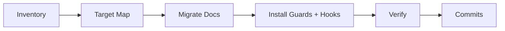

# Migrate Docs — Task Brief

A **copy-paste task brief**: bring an EXISTING project onto **MD-First 2.0**
([Docs Rules](rules/DOCS.md)) and install the **enforcement layer**
([Code Rules](rules/CODE.md) → Enforcement). Generic — it names no project; the
session discovers its own targets in Phase 0.

God-files found along the way are a SEPARATE task —
[REFACTOR-GODFILES.md](REFACTOR-GODFILES.md) — unless the owner has explicitly
bundled both into this session.

## Table of Contents

- [What You Are Being Asked to Do](#what)
- [Phase 0 — Inventory](#phase-0)
- [Phase 1 — Target Map](#phase-1)
- [Phase 2 — Docs Migration](#phase-2)
- [Phase 3 — Enforcement Install](#phase-3)
- [Phase 4 — Verify](#phase-4)
- [Phase 5 — Commits](#phase-5)
- [Hard Constraints](#constraints)
- [Definition of Done](#done)

---

<a id="what"></a>

## What You Are Being Asked to Do

The project's docs follow MD-First 1.0 (docs beside scripts — folders drowned in
`.md` files) or no convention at all, and it likely lacks guard tests and hooks.
You will: restructure docs into `___folder.md` + `__about/` + `__flow/` with
TIER discipline, make every doc TRUE against current code, install the four
guard tests + hooks, and leave the navigation chain unbroken and enforced.



---

<a id="phase-0"></a>

## Phase 0 — Inventory

Before touching anything, measure and report:

1. All source files (path, line count) — excluding vendored/build dirs
2. All existing `.md` docs and which convention they follow (beside-script /
   folder-doc / none)
3. **Tier classification of EVERY source file** per [Docs Rules](rules/DOCS.md)
   → Tiers: Trivial / Standard / Algorithmic / tests
4. God-files (> ~1,000 lines) — listed for the ratchet (and for a separate
   REFACTOR-GODFILES session unless bundled)
5. Config-law targets: the config/data files that will be named in
   `test_config_sections.py` `CONFIG_FILES`

<a id="phase-1"></a>

## Phase 1 — Target Map

Produce the full target state BEFORE executing: per folder — which `__about/`
and `__flow/` files will exist, which legacy docs get rewritten-and-moved,
which get DELETED (Trivial-tier docs, duplicates, dead docs). When the owner is
present, present the map and wait; in a **pre-authorized autonomous run**,
record the map in the final report and proceed.

<a id="phase-2"></a>

## Phase 2 — Docs Migration

**Step 0 — write `tests/test_doc_links.py` FIRST** (spec in Phase 3 /
[Code Rules](rules/CODE.md)) and run it after EVERY folder you migrate.
Relative-link depth (`../` counts change when docs move into `__about/`/`__flow/`)
is the DOMINANT failure mode of this migration — especially with parallel
agents. Caught per-folder it is a one-line fix; caught at the end it is an
archaeology dig. (Lesson from the PromptPainter pilot, 2026-08-01.)

Then, folder by folder:

1. Create `__about/` (and `__flow/` where the folder has Algorithmic-tier
   files); move each legacy doc to its new home with its basename matching the
   script
2. **Rewrite while moving — never blind-copy.** Verify every claim against the
   CURRENT code; docs that lie are the disease this migration cures. Missing
   docs required by tier are written fresh; `__flow/` content follows the
   templates (Mermaid + language-neutral pseudocode)
3. Update `___folder.md`: file table with tiers and links (per the template),
   connections, design decisions. Create it where it never existed
4. DELETE every legacy beside-script doc after its content has moved — no
   duplicates left behind
5. **Cross-cutting legacy docs** that map to no single file (feature
   narratives, aggregated overviews): verify their claims against code, fold
   the still-true gaps into the owning per-file/folder docs, then DELETE them
6. Maintain the chain upward: parent `___folder.md` and `README.md` links

<a id="phase-3"></a>

## Phase 3 — Enforcement Install

1. The four guard tests, standard names (spec: [Code Rules](rules/CODE.md) →
   Enforcement): `test_structure_law.py` (seed the RATCHET allowlist with the
   Phase 0 god-list — each entry: file, why, owed session),
   `test_config_sections.py` (seed `CONFIG_FILES`; add section banners to those
   files — comments ONLY, zero behavior change), `test_docs_coverage.py` (encode
   the Phase 0 tier lists), `test_doc_links.py`
2. A project with an EXISTING structure guard under a non-standard name: rename
   to the standard, keep its ratchet content, update references
3. `tests/run_guards.py` (fast wrapper, exit 2 on failure) +
   `.claude/settings.json` hooks (PostToolUse + Stop) per the spec
4. Update the project `CLAUDE.md`: point to the root constitution + Router,
   state project-specific laws only — delete any restated root rules

<a id="phase-4"></a>

## Phase 4 — Verify

1. `python tests/run_guards.py` → all four guards GREEN (structure law green
   modulo the seeded ratchet)
2. The project's own test suite: run it BEFORE Phase 2 (baseline) and now —
   identical results; this migration changes no behavior
3. Spot-check the chain by hand: README → a deep `__flow/` doc in ≤ 4 clicks

<a id="phase-5"></a>

## Phase 5 — Commits

Project version convention (`0.0.000 description`), grouped logically, e.g.:

```
x.y.NNN   Docs migration — __about/__flow structure for app/ and core/
x.y.NNN+1 Docs migration — folder docs, tier cleanup, legacy doc removal
x.y.NNN+2 Enforcement — guard tests, run_guards, Claude Code hooks
```

---

<a id="constraints"></a>

## Hard Constraints

1. **Zero code behavior change.** Allowed source edits: section banner COMMENTS
   for the config law — nothing else. God-file splitting is NOT this task
   unless explicitly bundled.
2. **Tier discipline.** No `__flow/` docs for glue files, no docs at all for
   Trivial tier — deleting a useless doc is progress, not loss.
3. **Truth over volume.** A migrated doc must be verified against current code;
   flag (don't silently fix) any code bug you notice while verifying.
4. **No version-suffix files;** edit and move directly — Git keeps history.
5. **Honest states** — the session ends FIXED / CANNOT FIX HERE / IMPOSSIBLE
   per the constitution, with evidence.

---

<a id="done"></a>

## Definition of Done

- [ ] Every code folder: `___folder.md` (+ `__about/`, `__flow/` per tier); zero
      legacy beside-script docs remain
- [ ] Every doc verified TRUE against current code
- [ ] Four guard tests + `run_guards.py` + hooks installed and GREEN (ratchet
      seeded and documented)
- [ ] Project test suite: baseline == after
- [ ] Project `CLAUDE.md` points to the root system; no restated root rules
- [ ] Commits per version convention
- [ ] Final report includes: target map, tier counts, deleted-doc list, ratchet
      entries, and an **INSTRUCTION FRICTION** section — every place where this
      brief or [Docs Rules](rules/DOCS.md) was ambiguous, contradictory or
      wrong in practice (the owner uses this to tune the instructions)
