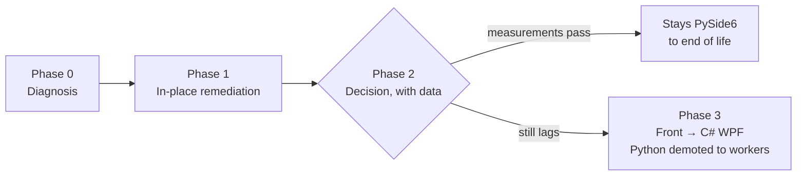

# Migrate GUI — Task Brief

A **copy-paste task brief**: take an EXISTING GUI project through the
**responsiveness verification** and — only where measurements prove it necessary
— migrate its front to the current default stack
([Start Rules](rules/START.md) → Technology Selection), while the Python backend
survives untouched as worker processes. Born from the owner decree 2026-08-04:
**the modern look stays; the lag goes.**

The core principle: **a rewrite is PROVED, never presumed.** Phases 0–1 are
cheap and stack-agnostic; Phase 3 happens only for projects that fail Phase 2
with numbers on the table. Nothing done in Phase 1 is throwaway — its aggregator
message format becomes the IPC contract of Phase 3.

## Table of Contents

- [Candidate Queue](#queue)
- [Phase 0 — Diagnosis](#phase-0)
- [Phase 1 — In-Place Remediation](#phase-1)
- [Phase 2 — Decision](#phase-2)
- [Phase 3 — Front Migration](#phase-3)
- [Hard Constraints](#constraints)
- [Definition of Done](#done)

---

## Candidate Queue (owner, 2026-08-04)

Queued, **NOT started** — each project waits for the owner's explicit go before
its Phase 0 begins:

| Project | Status |
|---------|--------|
| PromptPainter | queued |
| Watch Academy | queued |
| Aviator | queued |
| RHMH | queued |

---

## Phase 0 — Diagnosis (hours, read-mostly)

Before touching anything, measure and report:

1. **Symptom list** — what exactly lags: window resize? window move? in-window
   element changes (expand/collapse, tab/state switches)? startup time?
2. **Cause checklist** — walk the code for the known killers
   ([GUI Rules](rules/GUI.md) → Responsiveness): frameless window with custom
   title bar? `WA_TranslucentBackground`? `QGraphicsDropShadowEffect`? heavy
   QSS restyled on relayout? workers as THREADS doing CPU-bound work (GIL)?
   per-event GUI updates instead of batching? unvirtualized tables?
3. **Baseline measurements** — frame time during a live resize, UI-thread stall
   duration under worker load, startup to first interactive frame. These
   numbers are the yardstick every later phase is judged against; record them
   in the project docs.

---

## Phase 1 — In-Place Remediation (about a day)

Apply the fixes that transfer to ANY future stack — this work is never wasted:

1. **Workers → processes.** CPU-bound work (OCR, automation, queries) leaves
   the GUI process entirely; threads only for I/O waiting.
2. **Aggregator batching.** One channel collects worker output and delivers
   grouped updates to the GUI every 33–100 ms (10–30 Hz). No worker ever
   touches a GUI element directly.
3. **GPU-safe styling.** Remove the banned effects (software shadows,
   translucency hacks) or restore the system window frame; replace per the
   [DESIGN.md](DESIGN.md) recipes so the MODERN LOOK IS KEPT, not stripped.
4. **Model/view + virtualization** for every large table or list.
5. **Re-measure** the Phase-0 numbers, same method, and record before/after.

---

## Phase 2 — Decision (with data, owner confirms)

Judge the Phase-1 result against these criteria — and present the verdict to
the owner as a full block (context, numbers, options with consequences,
recommendation — [Plan Rules](rules/PLAN.md) → Communication):

1. **Measured result** — do resize / move / in-window changes now hold the
   responsiveness bar?
2. **Remaining lifespan** — a near-done or small tool is not worth a front
   rewrite even if imperfect.
3. **Python-boundness of the backend** — heavier Python ecosystem use makes
   the split model MORE attractive, not less (the backend stays either way).
4. **GUI complexity and growth** — the more the GUI will still grow, the more
   a migration pays off.

Outcomes: **passes** → the project stays PySide6 to end of life, zero further
cost; **fails** → migration candidate, enters Phase 3 only after the owner's
explicit confirmation for THAT project.

---

## Phase 3 — Front Migration (proven cases only)

1. The front is rewritten in **C# + WPF** (or the tree's fitting branch —
   [Start Rules](rules/START.md) → Technology Selection), styled per
   [DESIGN.md](DESIGN.md).
2. **The Python backend is NOT rewritten** — it is demoted to sidecar worker
   processes behind the Phase-1 aggregator protocol, now formalized as the IPC
   contract (JSON messages).
3. **The first migrated project is the pilot**: it establishes the C# scaffold,
   guard tests, hooks, build and release templates
   ([Ship Rules](rules/SHIP.md)) that every later migration copies.
4. The old GUI is deleted only after **verified parity** — every screen and
   interaction demonstrated working in the new front.

---

## Hard Constraints

- **No phase skipping** — Phase 3 without Phase 0/1 numbers is forbidden; a
  rewrite justified by feeling instead of measurement violates this brief.
- **Owner's explicit go** — per project, before Phase 0 and again before
  Phase 3.
- **The modern visual bar ([DESIGN.md](DESIGN.md)) is non-negotiable in every
  outcome** — remediation that makes a GUI ugly to make it fast has failed the
  task.
- **Measurements live in the project docs** — before/after, method stated, so
  the next session can reproduce them.

---

## Definition of Done

A session under this brief ends in one honest state per THE FIXED = VERIFIED
law ([CLAUDE.md](CLAUDE.md) → The Laws): the phase's artifact exists (symptom
report with numbers / before-after measurements / confirmed decision / paritied
front), docs of everything touched are updated, and commits follow the version
system.
