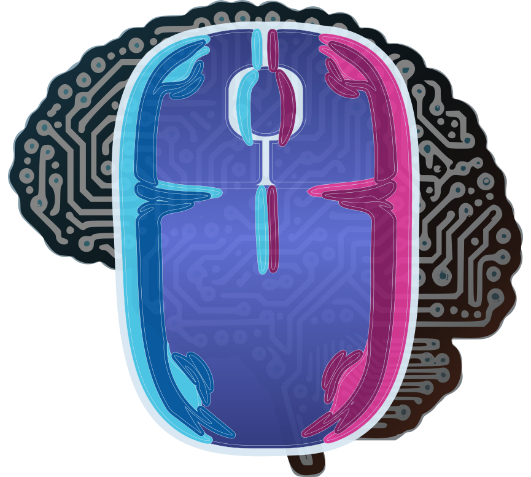
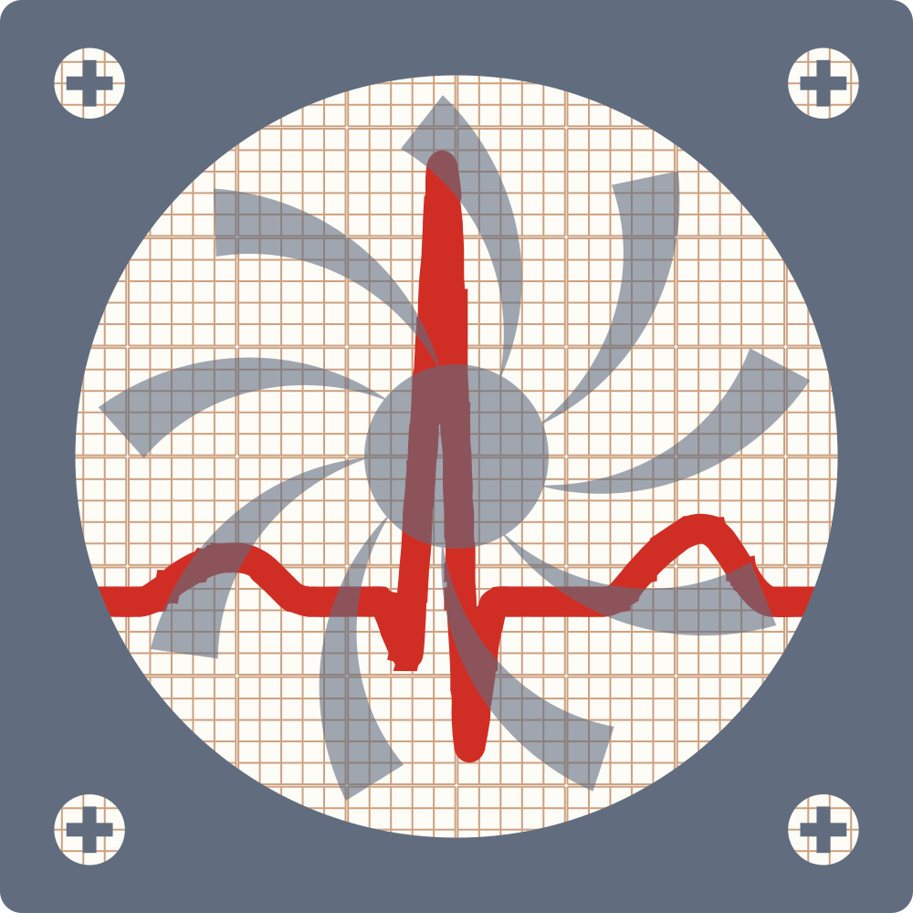
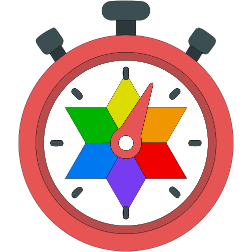
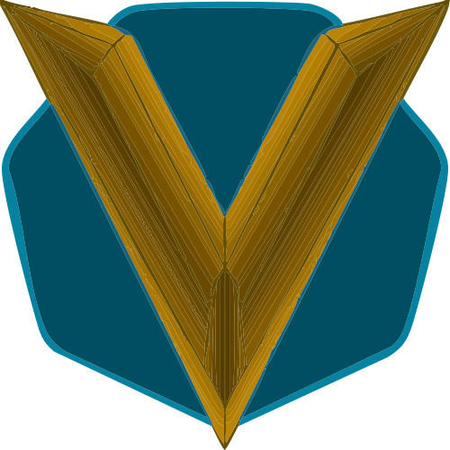
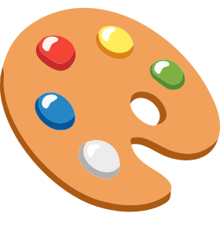
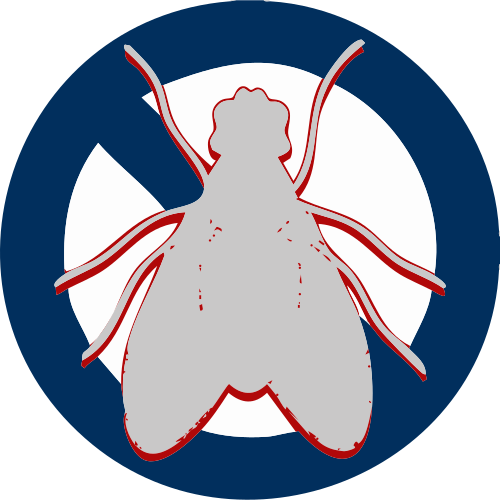
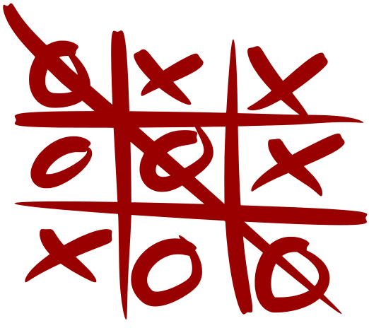

# Projects

Full index of all UVuruna projects — local and GitHub.
Visibility levels (Public / Private / Hidden) are defined in [CLAUDE.md](CLAUDE.md).

---

## Table of Contents

- [Machine Learning](#machine-learning)
- [Desktop Applications & Utilities](#desktop)
- [Web Projects](#web)
- [Games & Experiments](#games)

---

## 🤖 Machine Learning

---

###  Input DNA

**Local path:** `Machine Learning/Input DNA/`
**GitHub:** [UVuruna/InputDNA](https://github.com/UVuruna/InputDNA)
**Type:** Desktop Application (Windows)
**Status:** 🟢 Active
**Visibility:** Public

**Description:** First module of the UVirtual platform — a system that builds a complete virtual replica of a user. InputDNA captures exactly how a specific person moves the mouse and types on the keyboard. It records raw input data into SQLite in real-time, then trains ML models on that behavioral fingerprint. The end goal is a replay engine that reproduces the user's input indistinguishably from the real thing.

**Tech Stack:** Python, PySide6, pynput, SQLite (WAL mode)

**Architecture:** 4-thread queue-based recorder — mouse/keyboard listeners → event queue → event processor → write queue → single DB writer. Recorder is intentionally dumb: capture and store only, no analysis in real-time.

**Key Features:**
- Raw mouse path capture (per-point coordinates, nanosecond timestamps)
- Keyboard capture using hardware scan codes (layout-independent)
- Session-based grouping (mouse sessions, click groups, drag detection)
- Batched SQLite writes (100 records or 2s interval)
- System tray + PySide6 GUI (login, dashboard, session validation)

**Build:** PyInstaller + NSIS, UAC-admin elevation (required for `SetWindowsHookEx`), Windows Defender exclusions, Task Scheduler autostart

**Docs:** [README](Machine%20Learning/Input%20DNA/README.md)

---

###  Unreal Voice Sampler 🔒

**Local path:** `Machine Learning/Unreal Voice Sampler/`
**GitHub:** — (no public repository)
**Type:** Desktop Application (Windows)
**Status:** ⚪ Planned
**Visibility:** Private

**Description:** Voice counterpart of Input DNA — the second module of the UVirtual platform. Where Input DNA captures how a person moves the mouse and types, Unreal Voice Sampler captures how they sound: records voice samples through the microphone and trains a personal voice model toward the same virtual-replica goal.

---

## 🖥️ Desktop Applications & Utilities

---

###  Vitals (formerly PMUsage)

**Local path:** `Gadgets/Vitals/`
**GitHub:** [UVuruna/Vitals](https://github.com/UVuruna/Vitals)
**Type:** Desktop Application (Windows)
**Status:** 🟢 Active
**Visibility:** Public

**Description:** Lightweight Windows desktop gadget for real-time process monitoring. Shows the top N processes by CPU or Memory usage, tracks historical peak usage with timestamps, and displays CPU core/thread count per process. Minimal resource footprint — designed to always be visible without getting in the way.

**Tech Stack:** Python 3.11+, PySide6 (Qt6), psutil

**Architecture:** Single window — `ProcessMonitor` base class → `CPUMonitor` / `MemoryMonitor`, driven by `QTimer`. Monitor Pattern with inheritance for shared formatting and display logic.

**Build:** PyInstaller + NSIS, standard user (no UAC elevation), Registry `HKCU` autostart

**Docs:** [README](Gadgets/Vitals/README.md)

---

###  PromptPainter

**Local path:** `Gadgets/PromptPainter/`
**GitHub:** [UVuruna/Prompt-Painter](https://github.com/UVuruna/Prompt-Painter)
**Type:** Automation Tool (Windows, supervised)
**Status:** 🟡 In Development — built (parser + golden tests, CDP driver, resumable run loop, GUI with staged review); awaiting the first supervised live run
**Visibility:** Public

**Description:** Reads a prompt-sheet `.md` (theme + titled image prompts), drives the logged-in Gemini and/or ChatGPT tabs over CDP — both in parallel when asked — submits prompts one by one with a per-site background suffix (transparent for ChatGPT, white for Gemini), watches the send/stop button state for completion, captures each generated image directly from the DOM, runs the in-house background fix, and stages everything for the owner's review; only approval files an image at its final `<out>/<site>/<drop-path>`. Resumable, paced, sources strictly read-only.

**Tech Stack:** Python 3.13, Playwright (CDP attach)

---

###  DOMY Watch

**Local path:** `Gadgets/DOMY Watch/`
**GitHub:** [UVuruna/DOMY-Watch](https://github.com/UVuruna/DOMY-Watch)
**Type:** Desktop Application (Windows)
**Status:** 🟡 In Development — core feature-complete (dial, computation
core, skin/theme/roster system, Settings, Encyclopedia, Guide, Time
Travel); build/release pipeline remaining before v1 ships
**Visibility:** Public

**Description:** Transparent frameless 24-hour analog clock widget for the Windows desktop. Uses the Astral library to calculate location-aware astronomical data and visualizes it directly on the clock face — sunrise, sunset, dawn, dusk, moon phases, solar noon, and day-of-year position. Reads location from a hierarchical world location database.

**Tech Stack:** Python 3.13, PySide6 (Qt GUI), Astral (astronomical calculations), tzdata, JSON data (moon phases, seasons, world locations)

**Key Features:**
- 24h analog clock (hour + minute hands, no seconds hand)
- Sunrise/sunset and dawn/dusk arc visualization
- Moon phase tracking
- Earth position (day-of-year) indicator
- Solar noon hexagram overlay
- Location-aware timezone and daylight calculations
- Skinnable weekday/theme/palette roster system

---

###  Ultra Vivid (formerly Auto OpenRGB)

**Local path:** `Gadgets/Ultra Vivid/`
**GitHub:** [UVuruna/Ultra-Vivid](https://github.com/UVuruna/Ultra-Vivid)
**Type:** Utility / Automation (Windows)
**Status:** 🟢 Active
**Visibility:** Public

**Description:** Automatic RGB lighting profile switching based on time of day. Reads a config file defining profiles per time slot (dawn, morning, day, evening, night), generates VBS scripts for keyboard shortcut triggers, and creates Windows Task Scheduler tasks that run OpenRGB with the correct profile automatically.

**Tech Stack:** PowerShell, Python, VBScript, Windows Task Scheduler, OpenRGB

**Key Features:**
- Time-slot-based profile scheduling (configurable via JSON)
- Auto-generated VBS keyboard shortcuts for manual switching
- Task Scheduler integration for background execution
- PySide6 GUI for profile management

---

###  Icon Forge

**Local path:** `Gadgets/Icon Forge/`
**GitHub:** [UVuruna/Icon-Forge](https://github.com/UVuruna/Icon-Forge)
**Type:** Desktop Utility (Windows)
**Status:** 🟢 Active
**Visibility:** Public

**Description:** SVG/PNG → ICO converter and manager for the desktop `VSCode Projects` quick-open shortcut folder. Renders each project's logo into a crisp multi-resolution ICO (16–256px, supersampled) and stamps it onto that project's `.lnk`, so every project and every category ROOT folder opens in VS Code from a distinct, recognizable icon. Creates any shortcut that is missing.

**Tech Stack:** Python 3.13, PySide6 (QSvgRenderer), Pillow, PowerShell (WScript.Shell)

**Architecture:** Manifest-driven. `manifest.json` maps each entry (project or category ROOT) to its source SVG, target folder and shortcut; project logos are read directly from the monorepo `logos/` folder (no duplication). The engine renders ICOs (computed, gitignored) and delegates `.lnk` writing to a PowerShell helper. Ships a CLI (`run.py`) and a dark-themed PySide6 GUI.

**Docs:** [README](Gadgets/Icon%20Forge/README.md)

---

###  3D Preview

**Local path:** `Gadgets/3D Preview/`
**GitHub:** — (repo pending)
**Type:** Embeddable Component (Web + Desktop)
**Status:** 🟢 Active
**Visibility:** Public

**Description:** Embeddable 3D previewer — one Three.js core with orbit controls (rotate, zoom, pan), embedded by Python desktop GUIs as a PySide6 widget or by websites with a single script tag. Simple shapes (axes gizmo, cube) are computed from parametric JSON specs instead of stored model files; glTF/GLB load and export included.

**Tech Stack:** JavaScript (Three.js, esbuild), Python 3.11+ (PySide6 / QWebEngineView), hatchling

**Architecture:** One rendering implementation — `src/` bundles to a self-contained IIFE (`web/preview3d.min.js`, committed so consumers never need Node); websites load it directly, the Python package loads the same bundle through QWebEngineView and mirrors the JS API method-for-method (JSON specs and base64 model bytes across the bridge). Render-on-demand loop — an idle preview costs no GPU.

**Key Features:**
- Orbit controls: drag rotate, wheel zoom, right-drag pan
- Parametric primitives computed from JSON specs (Rule #19): axes gizmo with per-arm colors/labels, cube; more shapes are added as builders, never as model files
- glTF/GLB model loading (URL or raw bytes) and binary GLB export
- Transparent-background mode for see-through desktop widgets
- First consumers: DOMY Watch (labeled axes gizmo); Vaske Komarnici screen configurator planned

**Docs:** [README](Gadgets/3D%20Preview/README.md)

---

###  RHMH — Patient Management System

**Local path:** `Applications/RHMH/`
**GitHub:** [UVuruna/RHMH](https://github.com/UVuruna/RHMH)
**Type:** Desktop Application (Windows)
**Status:** 🟢 Active
**Visibility:** Public

**Description:** Medical patient management system for a reconstructive surgery hospital department. Manages patient records, medical imaging files, MKB-10 diagnosis catalog, staff/employee data, and operational analytics. Includes AI-powered OCR for reading documents, Google Drive integration for cloud backup, and supports both online and offline modes.

**Tech Stack:** Python, ttkbootstrap (Tkinter), customtkinter, SQLite, Google Drive API, PyTorch, EasyOCR, OpenCV, Pillow, Matplotlib

**Key Features:**
- Patient records with comprehensive form entry (diagnosis, operation date, imaging, etc.)
- Medical imaging file management and display
- MKB-10 diagnosis catalog integration
- AI-powered OCR document reading (EasyOCR + PyTorch)
- Google Drive cloud synchronization and backup
- Analytics with graph/statistical visualizations
- Session logging with performance metrics
- GodMode privileged admin access
- Multi-user support with role-based access

---

###  Remote User

**Local path:** `Applications/Remote User/`
**GitHub:** [UVuruna/Remote-User](https://github.com/UVuruna/Remote-User)
**Type:** Desktop Application (Windows) + Android Hybrid App (APK)
**Status:** 🟡 In Development — v1 loop shipped (H.264 streaming, touch controls, desktop app + installer, Android APK); on-device polish ongoing
**Visibility:** Public

**Description:** Remote control of the computer from an Android phone/tablet. The PC runs a Python server (desktop app with tray + QR pairing) that streams the screen as H.264 and injects input; the phone runs a hybrid app — a Kotlin shell around the web client the PC itself serves. A browser on the phone only ever sees the install funnel (Install → Open the app → paired automatically); everything else happens in the app: the finger steers the cursor, buttons click/drag/scroll, the phone keyboard types on the PC (full Unicode), images from the phone paste straight into the focused box. Works at home over LAN and anywhere via Tailscale, both guided entirely in-app. Updates flow downhill: the desktop checks GitHub Releases, the phone updates from the PC.

**Tech Stack:** Python 3.13, FastAPI, dxcam (DXGI), ffmpeg H.264 (NVENC/QSV/AMF/libx264 → fMP4/MSE), ctypes/SendInput, PySide6 + tray, vanilla JS client, Kotlin WebView shell (APK), Tailscale mesh, WebSocket

**Architecture:** Token-authenticated WebSocket — DXGI capture → per-client ffmpeg H.264 fMP4 → MSE canvas (JPEG region-streaming fallback); input JSON → Win32 `SendInput`. LAN + Tailscale (the app stores both addresses and probes at start). PyInstaller + NSIS installer bundles ffmpeg and the APK; the server serves the APK at `/app.apk`.

**Docs:** [README](Applications/Remote%20User/README.md)

---

## 🌐 Web Projects

---

###  Mladen Vuruna

**Local path:** `WebSites/MladenVuruna/`
**GitHub:** [UVuruna/mladenvuruna](https://github.com/UVuruna/mladenvuruna)
**Type:** Website
**Status:** 🟢 Live — [mladenvuruna.com](https://mladenvuruna.com)
**Visibility:** Public

**Description:** Personal portfolio website for a Serbian writer and artist. Showcases books with an interactive page-flip animation, essays, and an art gallery. Includes a visitor analytics system (IP, geolocation, pages visited, time spent), an IP-gated admin panel for content management, and a contact/comments system.

**Tech Stack:** PHP 8.x, Vanilla JavaScript, HTML5, CSS3, SQLite

**Key Features:**
- Book viewer with page-flip animation (WebP pages converted from PDF)
- Essays and art gallery sections
- Visitor analytics (IP tracking, geolocation, page views, time spent)
- IP-gated admin panel (password-protected)
- PDF upload → automatic WebP conversion (multiple sizes)
- Comments/contact system

---

###  SVG Styler (Colorize SVG)

**Local path:** `WebSites/Colorize SVG/`
**GitHub:** [UVuruna/SVG-Styler](https://github.com/UVuruna/SVG-Styler)
**Type:** Web Tool
**Status:** 🟢 Active
**Visibility:** Public

**Description:** Interactive browser-based tool for real-time SVG color and filter editing. Uses custom circular knob sliders with color-gradient visualization to adjust 7 CSS filter properties simultaneously. Features a build pipeline for production optimization.

**Tech Stack:** PHP, Vanilla JavaScript (ES modules), HTML5, CSS3, esbuild, SVGO, clean-css

**Key Features:**
- 7 real-time filters: brightness, contrast, saturation, hue-rotate, invert, sepia, grayscale
- Custom circular knob slider UI with color gradient visualization
- Real-time SVG preview
- SVG file upload and modified SVG export
- Production build pipeline (esbuild + SVGO + html-minifier)
- Mini version for embedding

---

###  Prirodni Sokovi

**Local path:** `WebSites/PrirodniSokovi/`
**GitHub:** [UVuruna/Prirodni-Sokovi](https://github.com/UVuruna/Prirodni-Sokovi)
**Type:** Website
**Status:** 🔵 Maintained
**Visibility:** Public

**Description:** E-commerce website for a natural juice company. Features a product catalog with 11+ juice combinations and individual ingredient pages. Implements a time-based theme system that automatically switches color schemes 4 times throughout the day (morning, noon, afternoon, night) based on Belgrade timezone.

**Tech Stack:** PHP, HTML5, CSS3, Vanilla JavaScript, JSON (product data)

**Key Features:**
- Product catalog with customizable juice combinations
- Ingredient information pages (apple, beetroot, carrot, ginger, etc.)
- Automatic time-based theme switching (4 daily themes)
- Cookie-based theme persistence

---

###  Vaske Komarnici

**Local path:** `WebSites/Vaske-Komarnici/`
**GitHub:** [UVuruna/Vaske-Komarnici](https://github.com/UVuruna/Vaske-Komarnici)
**Type:** Website
**Status:** 🔵 Maintained
**Visibility:** Public

**Description:** Commercial website for a window/door screen (mosquito net) products business. Features a product catalog with 3 categories (fixed, pleated, roller screens), a multi-step ordering system with persisted order state, installation guides, and SVG colorization for dynamic product visualization.

**Tech Stack:** PHP, HTML5, CSS3, Vanilla JavaScript (modular: interaction, media, ordering, style)

**Key Features:**
- Product catalog with 3 screen categories
- Ordering system with order memory/persistence
- Image preview and carousel
- Installation media guides
- SVG colorization for dynamic product color preview
- Time-based theme switching

---

## 🎮 Games & Experiments

Early Python projects — local under `Games/`, each with its own GitHub repository.

---

###  Texas Hold'em Poker

**Local path:** `Games/THP Enhanced/`
**GitHub:** [UVuruna/TexasHoldemPoker](https://github.com/UVuruna/TexasHoldemPoker)
**Status:** 🔴 Archived
**Visibility:** Public

**Description:** Texas Hold'em Poker game in Python with real-time probability calculation. Computes win probabilities based on the cards dealt and remaining cards in the deck.

**Tech Stack:** Python

---

###  Chess

**Local path:** `Games/ChessGame/`
**GitHub:** [UVuruna/Chess](https://github.com/UVuruna/Chess)
**Status:** 🎓 Legacy
**Visibility:** Public

**Description:** Chess game implementation in Python. Written during the learning years — kept as a record of progress, not representative of current work.

**Tech Stack:** Python

---

###  Tic-Tac-Toe

**Local path:** `Games/TicTacToe/`
**GitHub:** [UVuruna/TicTacToe](https://github.com/UVuruna/TicTacToe)
**Status:** 🎓 Legacy
**Visibility:** Public

**Description:** Classic Tic-Tac-Toe game in Python. Written during the learning years — kept as a record of progress, not representative of current work.

**Tech Stack:** Python

---

## Status Legend

| Badge | Meaning |
|-------|---------|
| 🟢 Active | Actively developed or in production |
| 🟡 In Development | Currently being built |
| 🔵 Maintained | Stable, occasional updates |
| 🔴 Archived | No longer maintained |
| 🎓 Legacy | Learning-era project — kept as a record of progress, not representative of current work |
| ⚪ Planned | Registered, not yet started |
| 🔒 | Private — description public, source code not |
