# Uros Vuruna — UVuruna

Full-stack developer working across desktop applications, AI/ML platforms, automation tools, and web projects.

---

## 🤖 AI & Machine Learning

| | Project | Description |
|--|---------|-------------|
| 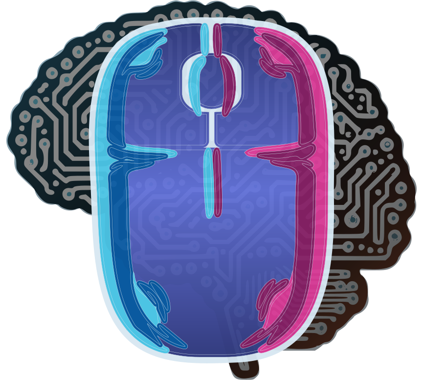 | [Input DNA](https://github.com/UVuruna/InputDNA) | ML platform that captures and learns unique mouse & keyboard behavior patterns — records raw input into SQLite, trains personal models, and can replay behavior indistinguishably from the real thing |

---

## 🖥️ Desktop Applications & Utilities

| | Project | Description |
|--|---------|-------------|
| 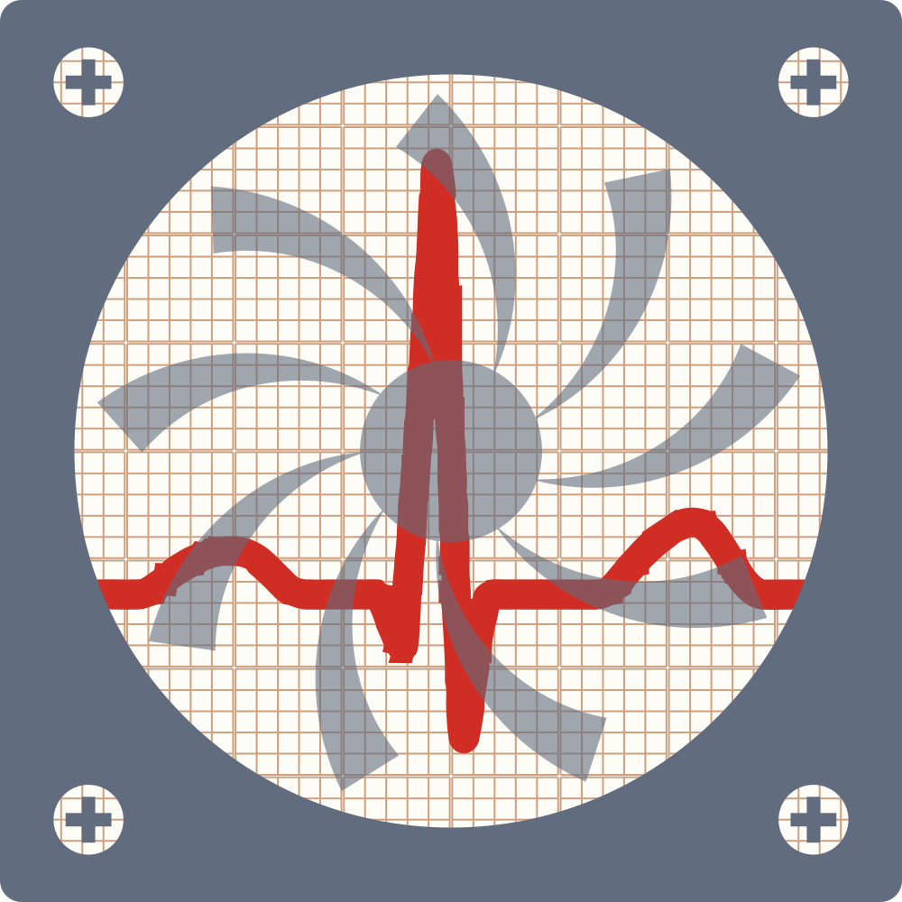 | [Process Memory Usage](https://github.com/UVuruna/ProcessMemoryUsage) | Real-time CPU & Memory process monitor — top N processes, historical usage peaks with timestamps, configurable refresh and display |
| 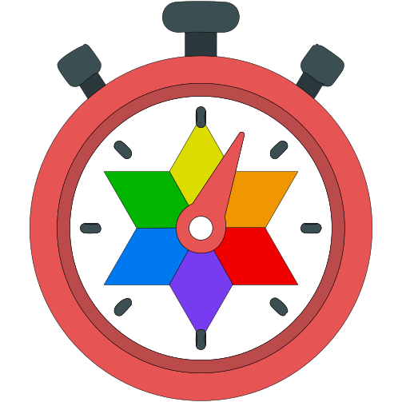 | [DOMY Watch](https://github.com/UVuruna/DOMY-Watch) | Advanced analog clock with astronomical data — sunrise/sunset, moon phases, seasonal markers, and day-of-year position |
| 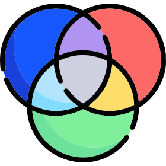 | [Auto OpenRGB](https://github.com/UVuruna/Auto-OpenRGB) | Automatic RGB lighting profile switching based on time of day — Task Scheduler integration, VBS keyboard shortcuts |
| 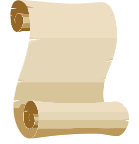 | [AutoRead](https://github.com/UVuruna/AutoRead) | E-learning automation tool — OCR-based timer detection, automatic course navigation and link clicking |
| 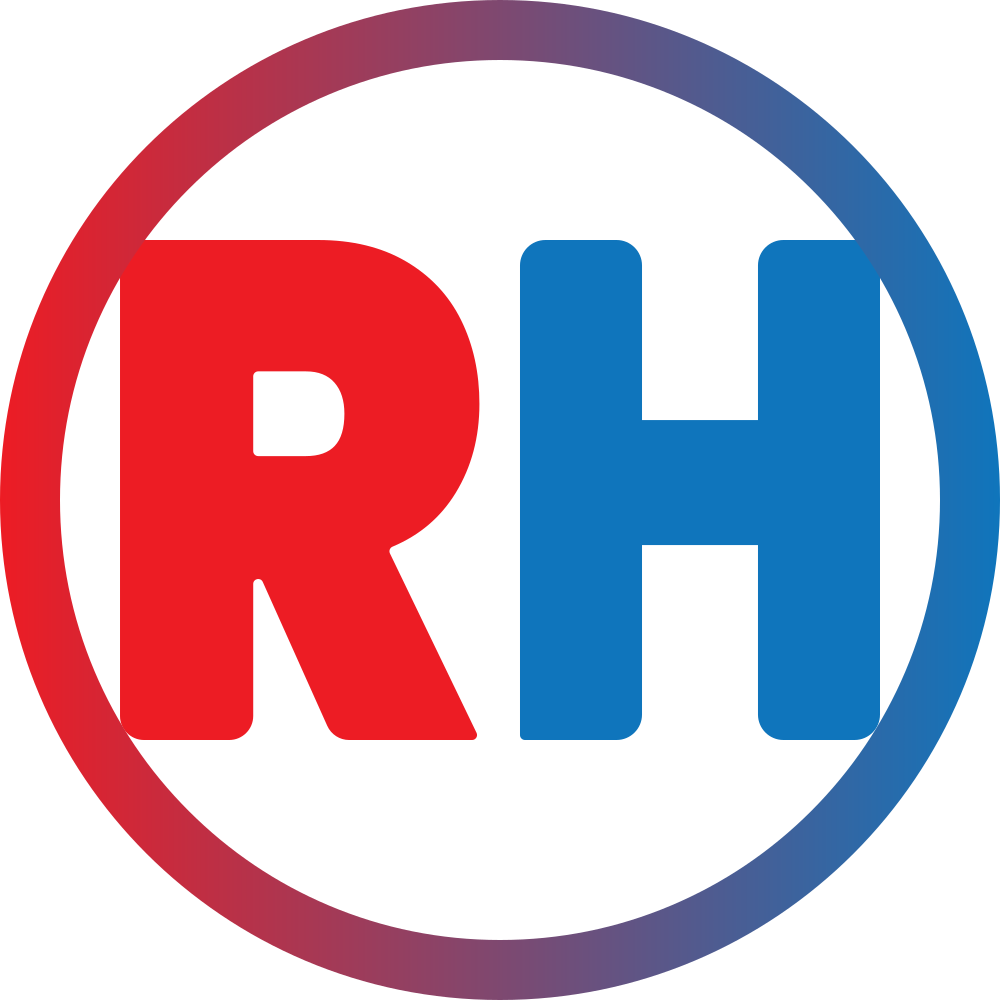 | [RHMH](https://github.com/UVuruna/RHMH) | Medical patient management system — records, imaging, MKB-10 diagnoses, AI-powered OCR, Google Drive sync, analytics |
| 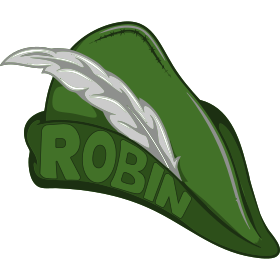 | Robin / Vili / Aviator 🔒 | Private |

---

## 🌐 Web Projects

| | Project | Description |
|--|---------|-------------|
| 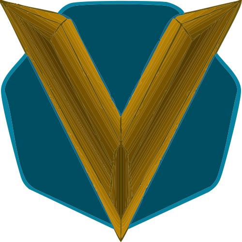 | [Mladen Vuruna](https://github.com/UVuruna/mladenvuruna) | Personal portfolio for a Serbian writer and artist — books with page-flip animation, essays, art gallery, visitor analytics |
| 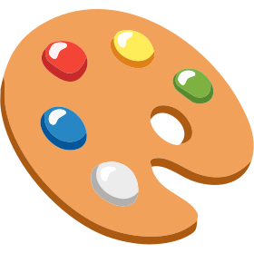 | [SVG Styler](https://github.com/UVuruna/SVG-Styler) | Interactive web tool for real-time SVG color editing — circular knob sliders for brightness, contrast, saturation, hue, and more |
| 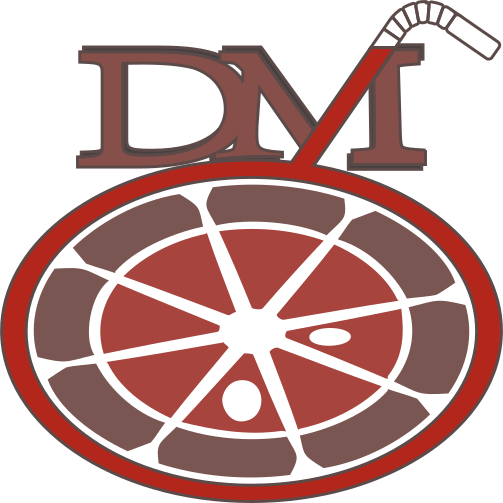 | [Prirodni Sokovi](https://github.com/UVuruna/Prirodni-Sokovi) | E-commerce website for a natural juice company — product catalog, ingredients, time-based theme system (4 daily themes) |
| 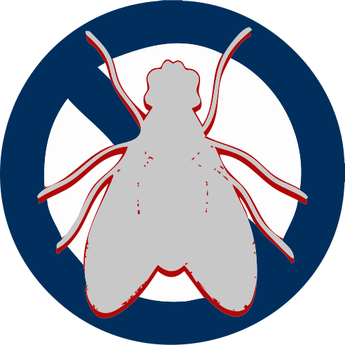 | [Vaske Komarnici](https://github.com/UVuruna/vaske-komarnici) | Commercial website for mosquito screen products — catalog with 3 product categories, ordering system, SVG colorization |

---

## 🎮 Games & Experiments

| | Project | Description |
|--|---------|-------------|
|  | [Texas Hold'em Poker](https://github.com/UVuruna/TexasHoldemPoker) | Poker game with real-time probability calculation based on remaining cards in the deck |
|  | [Chess](https://github.com/UVuruna/Chess) | Chess game implementation in Python |
| 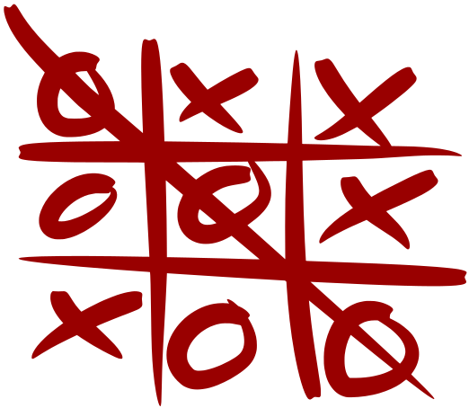 | [Tic-Tac-Toe](https://github.com/UVuruna/TicTacToe) | Classic Tic-Tac-Toe game in Python |

---

> 🔒 Private repository — source not publicly accessible
