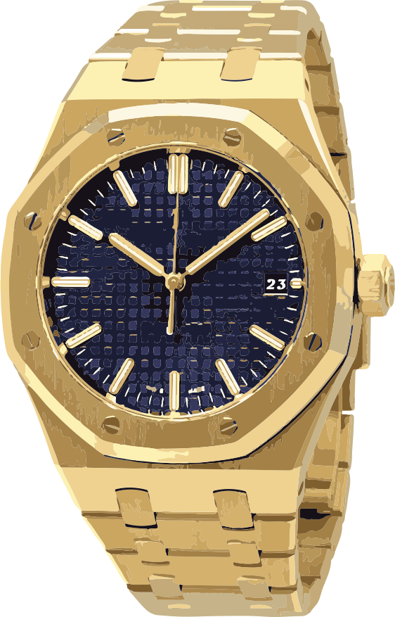

# Uros Vuruna — UVuruna

**Full-stack developer** — desktop applications, AI/ML platforms, automation tools and web projects.

📚 **[Full project index with architecture & tech stack →](PROJECTS.md)**

---

## ⭐ Featured Projects

### 🖥️ Desktop & AI

| | Project | Description |
|---|---------|-------------|
|  | [Input DNA](https://github.com/UVuruna/InputDNA) | ML platform that captures and learns unique mouse & keyboard behavior patterns — records raw input into SQLite, trains personal models, and can replay behavior indistinguishably from the real thing |
|  | [Vitals](https://github.com/UVuruna/Vitals) | Real-time CPU, Memory & Network process monitor — top N processes, historical usage peaks with timestamps, configurable refresh and display |
|  | [RHMH](https://github.com/UVuruna/RHMH) | Medical patient management system — records, imaging, MKB-10 diagnoses, AI-powered OCR, Google Drive sync, analytics |
|  | [Ultra Vivid](https://github.com/UVuruna/Ultra-Vivid) | Automatic RGB lighting profile switching based on time of day — Task Scheduler integration, VBS keyboard shortcuts |

### 🌐 Web

| | Project | Description |
|---|---------|-------------|
|  | [Mladen Vuruna](https://github.com/UVuruna/Mladen-Vuruna) | Personal portfolio for a Serbian writer and artist — books with page-flip animation, essays, art gallery, visitor analytics — live at [mladenvuruna.com](https://mladenvuruna.com) |
|  | [SVG Styler](https://github.com/UVuruna/SVG-Styler) | Interactive web tool for real-time SVG color editing — circular knob sliders for brightness, contrast, saturation, hue, and more |
|  | [Prirodni Sokovi](https://github.com/UVuruna/Prirodni-Sokovi) | E-commerce website for a natural juice company — product catalog, ingredients, time-based theme system (4 daily themes) |
|  | [Vaske Komarnici](https://github.com/UVuruna/Vaske-Komarnici) | Commercial website for mosquito screen products — catalog with 3 product categories, ordering system, SVG colorization — live at [vaske-komarnici.com](https://vaske-komarnici.com) |

---

## 🧰 More Projects

| | Project | Status | Description |
|---|---------|--------|-------------|
|  | [Watch Academy](https://github.com/UVuruna/Watch-Academy) | 🟡 In Development | Transparent 24h analog desktop clock with astronomical data — sunrise/sunset arcs, moon phases, solar noon, seasons |
|  | [PromptPainter](https://github.com/UVuruna/Prompt-Painter) | 🟡 In Development | Supervised image-generation runner — parses prompt-sheet markdown and drives Gemini/ChatGPT tabs over CDP |
|  | [Icon Forge](https://github.com/UVuruna/Icon-Forge) | 🟢 Active | SVG/PNG → ICO converter that stamps distinct icons onto the desktop VSCode quick-open shortcuts for every project and category folder |
|  | [3D Preview](https://github.com/UVuruna/3D-Preview) | 🟢 Active | Embeddable 3D previewer with two interchangeable renderers — a Three.js core for websites and rich models, and a QPainter one for Qt apps that cannot carry a browser engine; both play self-animating scenes written as JSON keyframes |
|  | Remote User | 🟡 In Development | Remote control of the computer from an Android tablet/phone — PC streams its screen to a browser PWA over LAN, tap moves the mouse and clicks, native keyboard types |
|  | Unreal Voice Sampler 🔒 | ⚪ Planned | Voice counterpart of Input DNA — samples how a person sounds via microphone and trains a personal voice model |
|  | [Texas Hold'em Poker](https://github.com/UVuruna/TexasHoldemPoker) | 🔴 Archived | Poker game with real-time win-probability calculation |
|  | [Chess](https://github.com/UVuruna/Chess) | 🎓 Legacy | Chess game implementation in Python — learning-era project |
|  | [Tic-Tac-Toe](https://github.com/UVuruna/TicTacToe) | 🎓 Legacy | Classic Tic-Tac-Toe game in Python — learning-era project |

---

> 🔒 Private — description public, source code not accessible
> 🎓 Legacy — learning-era project, kept as a record of progress
