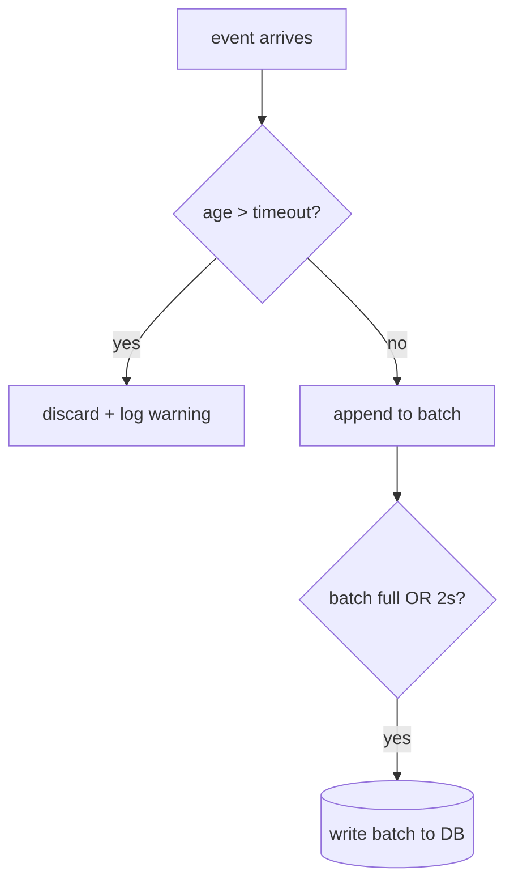

# DOCS — MD-First 2.0

**Who reads this:** every session that writes or migrates documentation — and
every coding session at the "update docs" step. Migration of an existing project
follows [MIGRATE-DOCS.md](../MIGRATE-DOCS.md).

Documentation-Driven Development is not a rule among rules — it is HOW this
organization programs. The goal: an agent that starts in a project gets oriented
fast and sees structure, responsibilities and connections without reading the
code first.

## Table of Contents

- [The Living Docs Rule](#living-docs)
- [Structure — Folder Docs & the Two Subfolders](#structure)
- [Tiers — Which File Gets Which Docs](#tiers)
- [Content Templates](#templates)
- [Navigation Chain & Link Formatting](#navigation)
- [Markdown Conventions](#markdown)
- [Enforcement](#enforcement)

---

<a id="living-docs"></a>

## The Living Docs Rule (owner decree 2026-08-01)

**Files are living bodies — their documentation lives and dies with them.**
The historical failure: docs are written once at file creation and never touched
again, so they slowly become lies — and a doc that lies is worse than no doc,
because agents trust it.

Therefore, in EVERY session, for EVERY file you change:

1. Open its `__about/` doc (and `__flow/` if it has one) and ask: *does my
   change alter what this says?* If yes — update it NOW, in the same session.
2. Walk the chain UPWARD: the folder's `___folder.md`, its parent's, up to
   `README.md` — update every level your change touched (new file listed,
   moved responsibility, changed connection).
3. A change without its doc update is UNFINISHED WORK — the Stop-hook guard
   (docs coverage + links) catches the structural part; the content part is
   the session's duty.

---

<a id="structure"></a>

## Structure — Folder Docs & the Two Subfolders

Docs no longer sit beside scripts (that drowned folders — real case: one `gui/`
folder held 28 scripts + 28 docs = 56 entries). Every code folder now has:

```
📁 gui/
  📝 ___gui.md              ← entry point: folder purpose, file list, links
  📁 __about/               ← WHAT: per-file description & connections
    📝 main_window.md
    📝 canvas_widget.md
  📁 __flow/                ← HOW: per-file visual algorithm / sketch / schema
    📝 main_window.md
    📝 canvas_widget.md
  🐍 main_window.py
  🐍 canvas_widget.py
```

- **`___folder.md`** (triple underscore — sorts first): unchanged role — folder
  purpose, list of its files (one line each), connections, design decisions,
  links into `__about/` and `__flow/`.
- **`__about/{name}.md`** — what the file does, its connections (Uses /
  Used by), classes/functions. Basename IDENTICAL to the script it describes.
- **`__flow/{name}.md`** — the file's logic shown VISUALLY:
  - algorithm file → Mermaid flowchart + language-neutral pseudocode
  - GUI file → layout sketch (zones, widgets) — Mermaid block diagram or a
    nested emoji list; always text, never images
  - config file → visual tree of its sections and keys
- Double underscore sorts the two doc folders directly under `___folder.md` and
  above the code — the folder shows its structure at a glance.

---

<a id="tiers"></a>

## Tiers — Which File Gets Which Docs

Docs are written where they carry information — never for ritual (the
compute-don't-generate principle applied to documentation; real case: a project
accumulated 441 doc files against 298 code files).

| Tier | Definition | Obligation |
|------|-----------|------------|
| **Trivial** | glue, `__init__`, re-exports, < ~60 lines of plain wiring | one line in `___folder.md` only — NO own docs |
| **Standard** | ordinary module | `__about/{name}.md` |
| **Algorithmic** | real algorithm, GUI window/widget, config/data table, protocol | `__about/{name}.md` **+** `__flow/{name}.md` |
| tests/ | test modules | `___tests.md` folder doc only |

The project's `test_docs_coverage.py` encodes the tier assignment (trivial
list / flow-required list) — changing a file's tier means updating that test in
the same commit.

Tier judgment rules (lessons from the 2026-08-01 pilot):

- **Nature beats the line band — in BOTH directions.** The ~60-line bound is a
  heuristic; a 300-line `__init__.py` of pure mechanical re-exports is still
  Trivial, and an 86-line Qt widget is still Algorithmic. When nature and line
  count disagree, nature decides — and the coverage test's tier list records
  the override.
- An `__init__.py` at Standard tier or above documents as
  `__about/__init__.md` — the identical-basename rule applies unchanged.
- `.md` files that are DATA, not documentation (e.g. `tests/fixtures/*.md`
  sample sheets), are exempt from the navigation chain via an explicit EXEMPT
  list inside `test_doc_links.py`.

---

<a id="templates"></a>

## Content Templates

### `___folder.md`

```markdown
# folder_name/

Purpose of the folder and its role in the system.

## Files

| File | Tier | One line |
|------|------|----------|
| `main_window.py` | Algorithmic | window shell, layout, wiring — [about](__about/main_window.md) · [flow](__flow/main_window.md) |
| `helpers.py` | Trivial | small shared formatters |

## Connections

### Uses
- [Other Component (folder)](../other/___other.md) — why

### Used by
- [Parent Component (folder)](../parent/___parent.md) — why

## Design Decisions
Why things are this way (not just what).
```

### `__about/{name}.md`

```markdown
# Component Name

**Script:** [Component Name (script)](../component_name.py) ·
**Flow:** [diagram](../__flow/component_name.md)   ← only if Algorithmic tier

## Purpose
What it does, why it exists.

## Connections
### Uses
- [Other Component](other_component.md) — why
### Used by
- [Parent Component](../../parent/__about/parent.md) — why

## Classes
### ClassName
Role. Key attributes and methods, one line each.
```

### `__flow/{name}.md`

```markdown
# Component Name — Flow

**About:** [description](../__about/component_name.md)

## Algorithm


Pseudocode (language-neutral — the owner must be able to follow it in any stack):

    FOR EACH event IN queue:
        IF event age > timeout → discard, log warning
        ELSE → append to batch
    WHEN batch full OR 2s passed → write batch to DB
```

GUI files sketch their zones; config files draw their section/key tree — same
Mermaid-or-nested-list approach, always text. A config module with REAL logic
(cached loaders, derivation) adds pseudocode under the tree — the tree shows
the data, the pseudocode the behavior.

---

<a id="navigation"></a>

## Navigation Chain & Link Formatting

**From the project `README.md` you must be able to reach EVERY `.md` file** by
following links: `README.md → ___module.md → __about/*, __flow/*`. This is
enforced by `test_doc_links.py` — unreachable or broken = failed build.

Stated exceptions (the test encodes them explicitly, never silently):

- **Excluded directories:** `.claude/`, `UV/`, caches, vendored/build dirs —
  their `.md` files are neither walked nor required
- **Links INTO `UV/`** (the owner's gitignored inbox) are not asserted — the
  target set is volatile by design
- **Data `.md` files** (fixtures, sample sheets) sit in the test's EXEMPT list

Link rules (unchanged from MD-First 1.0):

- Links point to `.md` files (scripts only via the explicit "(script)" link)
- Link text is human-readable — NEVER a raw path
- **Exception:** inside a `___folder.md` FILE TABLE, the compact
  `[about](__about/x.md) · [flow](__flow/x.md)` form is allowed — everywhere
  else the human-readable rule holds
- **Target not migrated yet?** When the target's `__about/` doc is not
  guaranteed to exist (mid-migration, other folder's turn), link its
  `___folder.md` instead — never a path you hope will exist
- **Mind the depth:** from `app/__about/x.md`, the folder doc of `core/` is
  `../../core/___core.md`; from `core/browser/__about/x.md` it is
  `../../../core/___core.md` — one `../` per level including the doc subfolder
- **No callers?** Write `Used by: none (entry point / not yet wired)` explicitly
  — never leave the section off. A FALSE connection claim inherited from a
  legacy doc is dropped, with a Design Decisions note when the correction is
  load-bearing

| Target | Link text | Example |
|--------|-----------|---------|
| `___folder.md` (top-level) | `Name (folder)` | `[App (folder)](app/___app.md)` |
| `___folder.md` (subfolder) | `Name (subfolder)` | `[GUI (subfolder)](app/gui/___gui.md)` |
| `__about/` doc | `Component Name` | `[App Controller](__about/app_controller.md)` |
| `__flow/` doc | `Component Name (flow)` | `[App Controller (flow)](__flow/app_controller.md)` |
| Script itself | `Name (script)` | `[App Controller (script)](app_controller.py)` |
| Files in structure trees | plain text, NO links | `🐍 app_controller.py` |

### README Opening = GitHub About (Rule #22)

Every project README opens with a 1–3 sentence plain paragraph (what it does,
for whom, on what platform — ≤ ~350 chars). That paragraph IS the GitHub About;
whenever a session changes it and a repo exists:
`gh repo edit <owner>/<repo> --description "<paragraph>"`. Longer intro → first
sentence is the About.

---

<a id="markdown"></a>

## Markdown Conventions

### Folder trees — emoji, never ASCII box-drawing

`├── └── │` break on narrow screens. Use emoji + 2-space indent:
📁 folder (📂 open) · 📄 file · 🐍 Python · 🔧 script (.ps1/.bat/.sh) ·
⚙️ config · 📝 markdown/text · 🖼️ image · 🗄️ database

### Diagrams — Mermaid, never ASCII art

Directions `LR`/`TB`; shapes `[box]` `(rounded)` `[(db)]` `{decision}`
`((circle))`; arrows `-->` `---` `-.-` `==>` `-- label -->`.
Every diagram WITH subgraphs starts with:

```
%%{init: {'flowchart': {'subGraphTitleMargin': {'top': 0, 'bottom': 35}}}}%%
```

### Anchors & TOC

Headers referenced from a TOC get an explicit `<a id="anchor-name"></a>` line
above them (GitHub/VSCode/GitLab generate anchors differently). Lowercase,
dashes, no emoji in the id. TOC sits immediately after the document title and
lists all `##` sections.

---

<a id="enforcement"></a>

## Enforcement

Two of the four project guard tests belong to this file
(spec: [CODE](CODE.md) → Enforcement):

- **`tests/test_docs_coverage.py`** — every source file has the docs its tier
  requires; tier lists live in the test and shrink/grow only with an
  accompanying doc change.
- **`tests/test_doc_links.py`** — the full navigation chain from `README.md`:
  every project `.md` reachable, zero broken relative links.

Both run in the Stop hook — a session cannot end with missing or orphaned docs.
Content truth (docs that structurally exist but lie) cannot be machine-checked:
that is what the Living Docs Rule and owner review are for.
