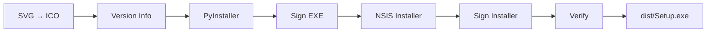

# SHIP — Build & Release Rules

**Who reads this:** sessions building or releasing an installable desktop app —
and EVERY session that finishes work on one (build + release close the work,
automatically). Websites and pure libraries do not use this pipeline.

## Table of Contents

- [The Release Law](#release-law)
- [Version Source & Metadata](#metadata)
- [Build Pipeline (7 Steps)](#pipeline)
- [Certificate Management](#certificates)
- [GIT RELEASE Procedure](#git-release)
- [Self-Update](#self-update)

---

<a id="release-law"></a>

## THE RELEASE LAW (owner decree 2026-07-23, SHOUTED)

**Every session that produces a successful build of an installable app MUST
immediately create a GIT RELEASE. Do NOT ask — this is standing, durable
authorization.** The owner installs and updates ONLY through the official GitHub
release (the self-update path below); local `dist/` is a build by-product, never
the deliverable. A build that is not released is invisible to the update
mechanism and therefore useless.

- Build → verify → tag → push → `gh release create`, in ONE unbroken flow.
  Never release an artifact the current session did not just build and verify.
- Version comes from the single version source, bumped per the commit
  convention (zero-padded patch); tag is `v{version}`; never re-release an
  existing tag — bump first. Release notes = commits since the previous tag.
- Scope: every installable app WITH a GitHub repo. No repo yet → still build;
  creating the repo is the owner's call (surface it, don't stall). Hidden
  projects (never on GitHub) are the only ones that skip the release.
- This is outward-facing publishing the owner has PERMANENTLY authorized — the
  general "confirm outward-facing actions" guidance does not apply to this one
  decreed action.

---

<a id="metadata"></a>

## Version Source & Metadata

**`setup/app_info.json`** (tracked) — project metadata:

```json
{
  "version": "0.0.000",
  "name": "ProjectName",
  "description": "What this app does",
  "exe_name": "ProjectName.exe",
  "installer_name": "ProjectName_Setup.exe"
}
```

**Root [company.json](../company.json)** — company-level metadata read by every
build script (`company_name`, `developer`, `copyright_string`, `copyright_year`,
`website`). Never duplicate it per project. `copyright_year` is updated ONCE a
year, in the first build session of the new year.

**Project logo:** `assets/logo.svg` (required; optional `assets/logo-setup.svg`
for the installer wizard) — the pipeline generates multi-resolution ICOs from
it. A copy lives at root `logos/{ProjectName}.svg`.

**`setup/` folder:** `build.py` (orchestrator), `create_cert.py` (run once),
`installer.nsi`, `svg_to_ico.py`, `app_info.json`, `cert/` (gitignored — back
up externally).

---

<a id="pipeline"></a>

## Build Pipeline (7 Steps)



**Step 1 — SVG → ICO** (`svg_to_ico.py`): QSvgRenderer + Pillow supersampling;
16/32/48/64/128/256 px; sizes ≤64 px rendered 4× and Lanczos-downscaled.
`logo.svg → setup/icon.ico` (EXE/taskbar), `logo-setup.svg` (or fallback
`logo.svg`) `→ setup/icon-setup.ico` (NSIS wizard).

**Step 2 — Version Info** (`build.py`): reads `app_info.json` + root
`company.json`, generates the version-info file at build time (gitignored),
embedded as the Windows VERSIONINFO resource.

**Step 3 — PyInstaller:** `--onedir` (not `--onefile` — lower RAM, faster
startup, fewer AV false positives), `--windowed`, `--uac-admin` ONLY when truly
required (low-level hooks), exclude unused modules. Output:
`dist/{Project}/{Project}.exe`.

**Step 4 — Sign EXE** (`signtool.exe`, Windows SDK): cert
`setup/cert/{Project}.pfx`; password read from `setup/cert/password.txt` — NEVER
hardcoded; timestamp `http://timestamp.digicert.com`.
**Signing is a reusable `sign_file()` function applied to BOTH artifacts** —
the inner exe here AND the installer after Step 5. Signing only the inner exe
ships an unsigned installer — the file the user actually downloads — which
defeats the SmartScreen mitigation entirely (a real, historical pipeline
defect).

**Step 5 — NSIS Installer** (`makensis.exe`): LZMA solid; admin execution
level; sections Main (required) / Desktop shortcut (optional) / Autostart
(optional); Defender exclusions ONLY for low-level-hook apps. Autostart:
standard apps → `HKCU\...\Run`; UAC-elevated apps → Task Scheduler
`/rl highest` (Registry Run silently skips elevated apps). Output:
`dist/{Project}_Setup.exe`.

**Step 6 — Sign Installer:** same cert/function on `dist/{Project}_Setup.exe`;
then `Get-AuthenticodeSignature` must not report `NotSigned`.

**Step 7 — Verify (fail-closed gate)** — the LAST thing `build.py` does, and
required in every project. Every prior step fails SILENTLY (PyInstaller without
`--version-file` still builds; a skipped signing still yields a file) — so
`verify_build(exe, installer)` asserts on the OUTPUT and `sys.exit(1)` unless
ALL hold:

- exe `CompanyName` == `company.json` `company_name`
- exe `FileVersion` contains the project version
- when a cert is configured: BOTH exe AND installer carry an Authenticode
  signature (self-signed → status won't be `Valid` but must never be
  `NotSigned`/empty)

Signing asserts are skipped only when signing itself is skipped (no cert/no
password) — the documented-optional path. Reference implementation:
`Gadgets/Ultra Vivid/setup/build.py` (`verify_build`).

---

<a id="certificates"></a>

## Certificate Management

One-time per project: `python setup/create_cert.py` → self-signed
`CN=UVuruna`, 5 years, `CodeSigningCert`; writes `setup/cert/{Project}.pfx` +
`password.txt` (both gitignored — **back them up externally**). Recreate only on
expiry or corruption.

---

<a id="git-release"></a>

## GIT RELEASE Procedure

Mandatory and automatic after every successful build — never gated behind a
question.

```bash
# 1. Verify the artifact built + verified THIS session
ls dist/

# 2. Push branch, create and push the version tag
git push origin HEAD
git tag v{version}
git push origin v{version}

# 3. GitHub release with the SIGNED installer as artifact
gh release create v{version} "dist/{ProjectName}_Setup.exe" \
  --title "v{version}" \
  --notes "$(git log --oneline {prev_tag}..HEAD)"
```

---

<a id="self-update"></a>

## Self-Update (owner decree 2026-07-22)

**Every installable app checks the LATEST GitHub release at startup and, if
behind, offers an in-app UPDATE.** The last published release is the single
source of truth for "current version". Reference implementations:
`Applications/VibeCoder/server/updates.py`,
`Gadgets/Ultra Vivid/core/updates.py` — reuse, don't reinvent.

- An `updates` module exposes `check(repo, enabled) -> Update | None` reading
  `api.github.com/repos/<repo>/releases/latest` (public, unauthenticated);
  returns `Update(version, installer_url, page_url)` only when strictly newer.
- **`None` is a NORMAL result** (up to date / disabled / dev checkout / no
  releases / ANY network failure) — logged at info, never raised; the app must
  start fine offline (a documented, explicit fallback).
- Config, not hardcode: `update: { "repo": "<owner>/<repo>", "check": true }`.
- The check runs OFF the UI/main path (worker thread; never a synchronous
  stall). The UX OFFERS, never forces: a visible "Update to vX" affordance →
  download installer asset to temp, launch (elevated as its manifest requires),
  quit. No installer asset → open the release page.
- Running version comes from the single version source, bundled into the build.
- **Ecosystem apps update downhill:** only the desktop/hub touches the
  internet; companions learn the version from the hub and update from it (see
  Vibe Coder). One internet check per ecosystem.
- Exempt: pure libraries and CI-deployed websites — this rule is about
  installed apps a user runs a stale copy of.
